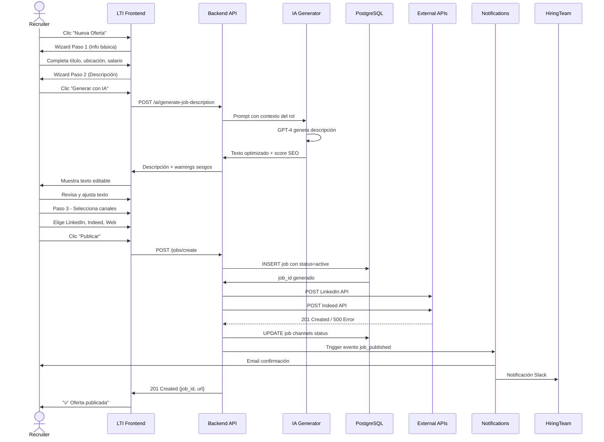
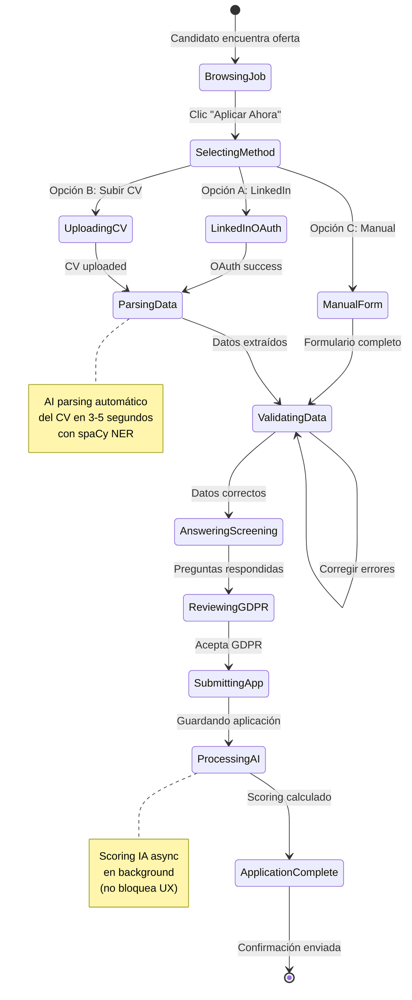
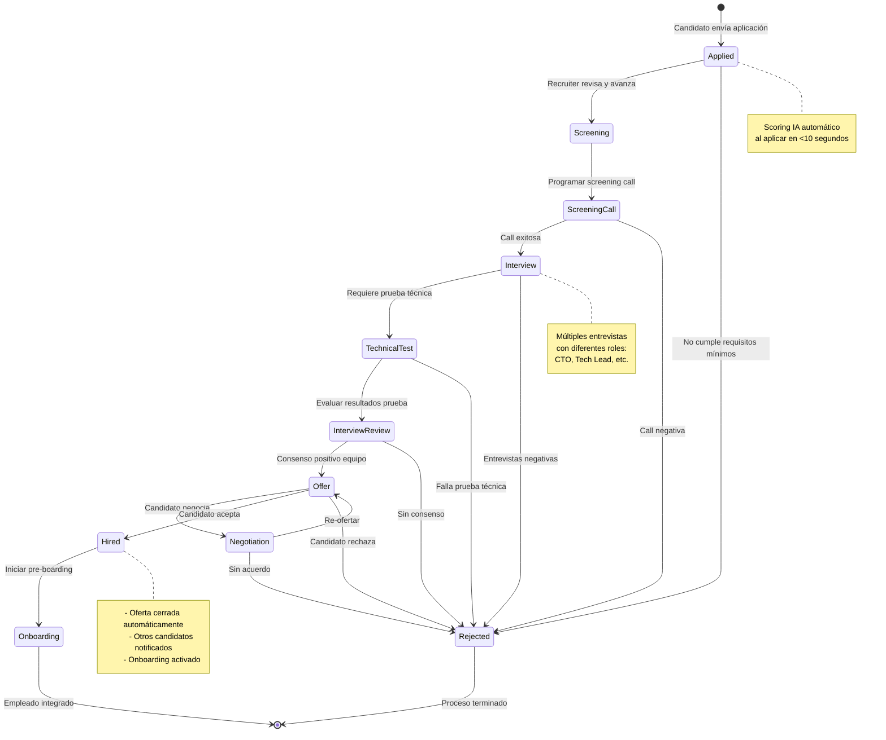
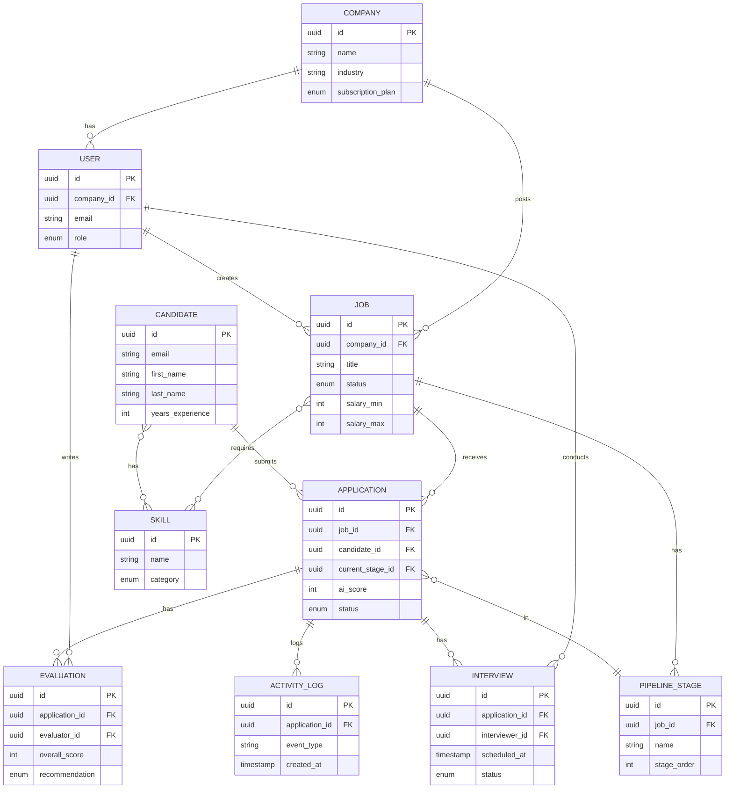
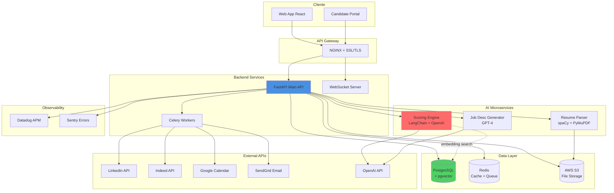
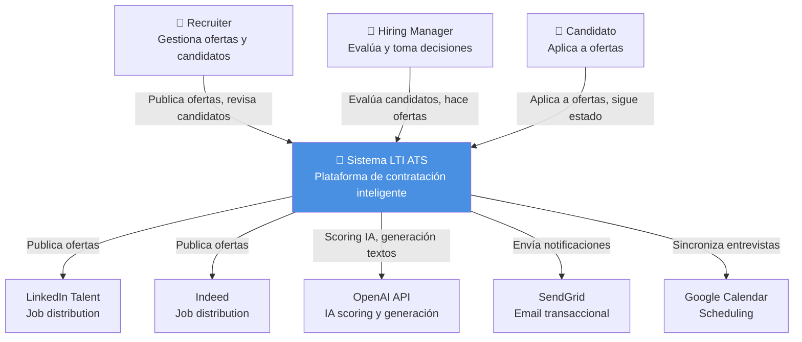
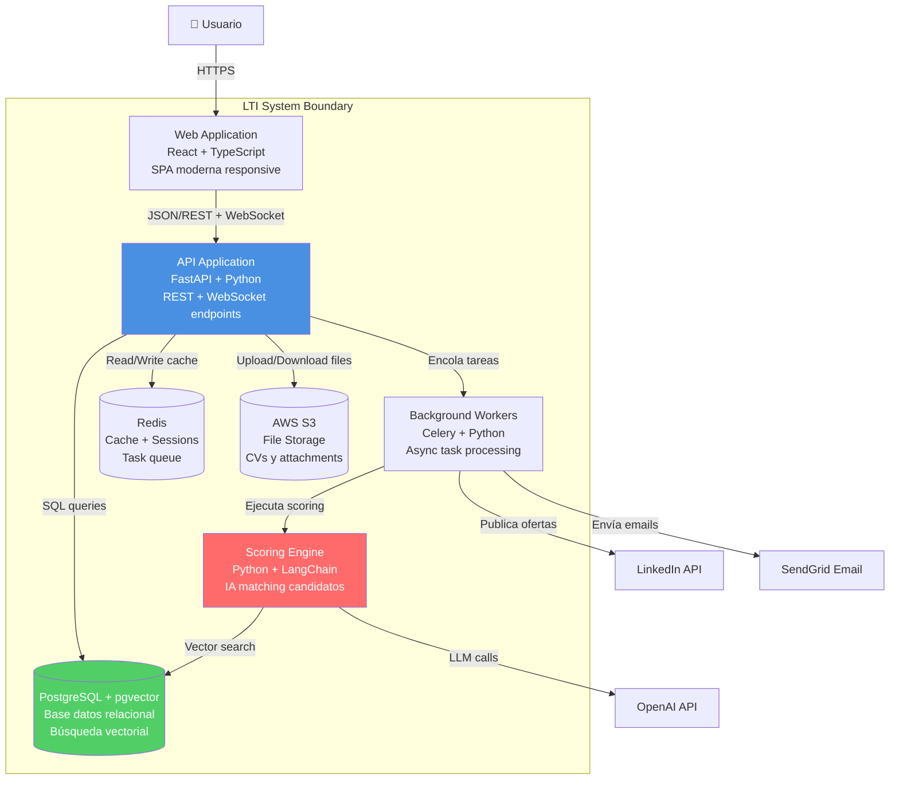
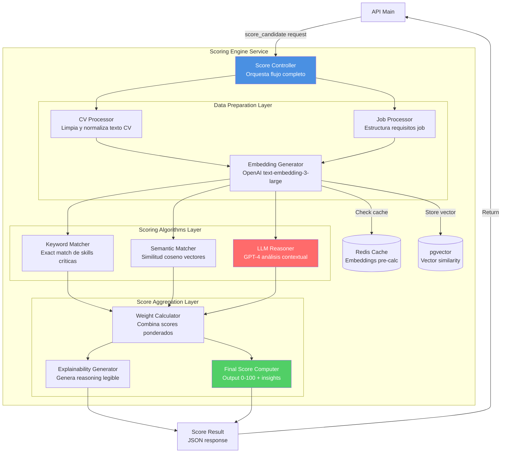

# LTI - Sistema ATS (Applicant Tracking System)

**Autor**: AJM

**Fecha**: 15 de noviembre de 2025

**Versión**: 1.0

---

## Índice

1. [Descripción del Software](#1-descripción-del-software)
2. [Lean Canvas](#2-lean-canvas)
3. [Casos de Uso Principales](#3-casos-de-uso-principales)
4. [Modelo de Datos](#4-modelo-de-datos)
5. [Diseño de Alto Nivel](#5-diseño-de-alto-nivel)
6. [Diagrama C4](#6-diagrama-c4)

---

## 1. Descripción del Software

### ¿Qué es LTI?

**LTI (Leading Talent Intelligence)** es un ATS de nueva generación diseñado específicamente para startups tecnológicas en crecimiento (20-500 empleados). A diferencia de los sistemas ATS tradicionales como Greenhouse, Lever o Workable que funcionan esencialmente como bases de datos de CVs con workflows rígidos y procesos manuales, LTI actúa como un **copiloto inteligente** que combina IA conversacional, automatización inteligente y colaboración en tiempo real para transformar completamente la experiencia de reclutamiento.

La diferencia fundamental radica en cómo LTI entiende y procesa la información. Mientras que los ATS tradicionales se basan en búsquedas por palabras clave simples (buscando coincidencias literales como "React" o "Python"), LTI utiliza modelos de lenguaje avanzados y búsqueda vectorial semántica para comprender el contexto real de las habilidades y experiencias. Por ejemplo, si un candidato menciona "NextJS + Vercel" en su CV, LTI entiende que esto representa conocimiento avanzado de React y ecosistema moderno, no solo una coincidencia literal de términos.

LTI facilita la colaboración de manera similar a herramientas modernas como Notion o Linear, con workspaces en tiempo real donde los equipos pueden mencionar colaboradores, crear threads de discusión, documentar decisiones en contexto y mantener toda la información de cada candidato organizada y accesible. Además, automatiza comunicaciones personalizadas con candidatos utilizando IA generativa, asegurando que cada email menciona específicamente las habilidades relevantes y la experiencia del candidato, manteniendo la personalización humana pero a escala.

### Valor Añadido y Ventajas Competitivas

#### Problemas que Resuelve LTI

1. **Time-to-hire excesivo (45+ días)**: Las startups tech pierden candidatos top por procesos lentos y burocráticos. LTI reduce el tiempo de contratación a 15-20 días mediante automatización inteligente, screening semántico instantáneo y coordinación automática de entrevistas.

2. **Calidad de contratación baja (decisiones sin datos = bad hires 3x salario)**: Muchas contrataciones fallan por falta de datos objetivos y sesgos inconscientes. LTI proporciona scoring cuantificado, evaluaciones estructuradas con rubricas calibradas y analytics predictivos que correlacionan el performance inicial con el éxito real a 6-12 meses.

3. **Mala experiencia del candidato (ghosting, falta transparencia)**: Los candidatos se sienten ignorados cuando no reciben feedback o actualizaciones. LTI mantiene comunicación constante con chatbots IA 24/7, portal transparente con estado del proceso en tiempo real y recordatorios automáticos que eliminan el "ghosting" completamente.

4. **Falta de colaboración (feedback disperso en emails)**: El feedback del equipo está fragmentado en emails, Slack y documentos sueltos, dificultando decisiones informadas. LTI centraliza todo en workspaces colaborativos estilo Notion con mentions, threads, historial completo y decisiones documentadas en contexto.

5. **Costes de recruiting altos (ATS desde 5.000€/año inaccesibles para early-stage)**: Las soluciones enterprise como Greenhouse cuestan 5.000-15.000€/año con contratos anuales obligatorios, inaccesibles para startups en etapas tempranas. LTI ofrece modelo freemium (0€ para hasta 3 ofertas) y pricing pay-as-you-grow desde 99€/mes sin lock-in ni compromisos anuales.

#### Diferenciadores Clave vs Competencia

| Característica | ATS Tradicionales | **LTI (Ventaja Competitiva)** |
|----------------|-------------------|-------------------------------|
| **Screening de CVs** | Keyword matching rígido (busca "React" literal) | 🤖 **Matching semántico con LLM**: entiende "NextJS + Vercel" como conocimiento React avanzado mediante embeddings y búsqueda vectorial |
| **Comunicación candidatos** | Emails plantilla genéricos enviados manualmente | ✉️ **IA generativa personalizada**: cada email menciona específicamente skills relevantes del candidato y su experiencia |
| **Colaboración equipo** | Comentarios asincrónicos en interfaz anticuada | 🧑‍🤝‍🧑 **Workspace en tiempo real** estilo Notion: mentions, threads, decisiones documentadas en contexto |
| **Insights y métricas** | Reportes PDF semanales estáticos sin acción | 📊 **Dashboard predictivo en tiempo real**: "Esta oferta cerrará en 12 días con 85% de confianza" |
| **Experiencia candidato** | Portal básico sin visibilidad del proceso | 💬 **Chatbot IA 24/7** + portal transparente con estado actual y próximos pasos claros |
| **Pricing** | Desde 5.000€/año con contratos anuales obligatorios | 💰 **Freemium + pay-as-you-grow**: desde 0€ hasta 299€/mes sin compromisos ni lock-in |

### Funciones Principales

#### 1. Gestión Inteligente de Ofertas

- Creador de job descriptions con IA que optimiza para SEO y elimina sesgos de género/edad/origen

- Publicación multicanal automatizada (LinkedIn, Indeed, InfoJobs, web corporativa) con un solo clic

- A/B testing integrado de títulos y descripciones para maximizar aplicaciones de calidad

- Análisis de mercado competitivo: salarios promedio por rol y ubicación, requisitos comunes en ofertas similares

#### 2. Pipeline Visual Personalizable

- Kanban drag-and-drop con stages customizables por departamento (Applied → Screening → Interview → Offer → Hired)

- Automatizaciones visuales tipo Zapier: "Si candidato no responde en 48h → mover a 'Descartado'"

- Vista timeline con historial completo de interacciones por candidato

- Filtros avanzados multi-criterio: skills, seniority, location, diversity metrics, scoring range

#### 3. AI-Powered Candidate Screening

- Parsing inteligente de CVs con NER (Named Entity Recognition) extrae skills, experiencia, educación automáticamente

- Scoring 0-100 con explicabilidad: "Match 87/100 porque: Python (5 años) ✅, FastAPI (2 años) ✅, falta: Kubernetes ⚠️"

- Preguntas de screening dinámicas generadas automáticamente según requisitos del rol

- Detección de inconsistencias y red flags: gaps temporales, educación verificable, experiencia coherente

#### 4. Calendario de Entrevistas Automático

- Integración bidireccional Google Calendar/Outlook sincronizados en tiempo real

- Self-scheduling: candidato selecciona slots disponibles, sistema confirma automáticamente

- Recordatorios inteligentes 24h y 1h antes por email y SMS

- Video entrevistas integradas (Zoom/Google Meet/Microsoft Teams embebido)

#### 5. Evaluaciones Colaborativas Estructuradas

- Templates por rol: "Entrevista técnica backend" con rubrica predefinida (technical skills, communication, problem solving)

- Scoring calibrado garantiza consistencia entre evaluadores

- Detección de sesgos: IA analiza comentarios buscando lenguaje sesgado sobre género, edad, origen

- Feedback asíncrono: cada entrevistador completa su evaluación independientemente, sistema consolida automáticamente

#### 6. Analytics Predictivo

- Time-to-hire por rol, departamento, seniority con benchmarks del sector

- Quality of hire: correlación entre scoring inicial y performance real a 6/12 meses

- Diversity metrics: distribución género, edad, origen en cada stage para detectar problemas de sesgo

- Cost-per-hire: tracking completo de inversión por canal (LinkedIn Ads, referidos, job boards)

#### 7. Integraciones Nativas

- Job boards: LinkedIn Talent Solutions, Indeed Publisher, InfoJobs, Glassdoor

- HRIS: BambooHR, Personio, Factorial (sincronización automática al contratar)

- Assessment tools: HackerRank, Codility, TestGorilla para pruebas técnicas

- Background checks: Certn, Checkr (lanzar verificación con un clic)

- APIs abiertas: Webhooks y REST API para integraciones custom

---

## 2. Lean Canvas

### Modelo de Negocio LTI

| **PROBLEM** | **SOLUTION** | **UNIQUE VALUE PROPOSITION** | **UNFAIR ADVANTAGE** | **CUSTOMER SEGMENTS** |
|-------------|--------------|------------------------------|----------------------|----------------------|
| 🔴 **Top 3 problemas críticos con datos:**<br>• Time-to-hire 45+ días (87% menciones)<br>• Bad hires 3x salario (71% no mide)<br>• 50% abandonos por mala experiencia | ✅ **Top 3 features:**<br>• IA pre-filtra <5min ahorra 80% tiempo<br>• Scoring predictivo 10M+ data correlaciona con performance<br>• Portal transparente + chatbot reduce abandonos 70% | 🎯 **"El ATS que contrata por ti"**<br>Reduce time-to-hire 60% (6 sem → 2 sem) con IA que entiende talento en escala | 🚀 **Algoritmo propietario matching semántico**<br>+ Dataset 10M+ CVs + 500K+ contrataciones + 3 años feedback humano = imposible replicar | 👥 **Primary:** Startups tech 20-500 empleados, 3-10 contrataciones/trimestre, budget <10K/año<br>📊 **Secondary:** Agencias recruiting 5-20 consultores gestionan 20-50 procesos |
| **KEY METRICS** | **CHANNELS** | **COST STRUCTURE** | **REVENUE STREAMS** |
| 📈 **North Star:** time-to-hire <15 días<br>• Quality of hire >85%<br>• Candidate NPS >50<br>• MAU + ARR<br>• Automation >70%<br>• Churn <5% | 🎯 **Adquisición:**<br>• SEO inbound<br>• LinkedIn Ads<br>• PLG freemium<br>• Partnerships HRIS<br><br>💚 **Retención:**<br>• Onboarding 30d<br>• CS proactivo<br>• Academy | 💰 **Fijos 60%:**<br>• Equipo €350K<br>• Infra €24K/año<br>• Support €80K<br>• Marketing €50K<br>• Legal €20K<br><br>📊 **Variables 40%:**<br>• APIs LLM €0.02/candidato<br>• Observabilidad €500/mes<br>• CAC €300<br>• Emails €200/mes | 💵 **Free:** 0€ (1 user, 3 ofertas)<br>🚀 **Starter:** 99€/mes (5 users, 10 ofertas, IA básica)<br>⭐ **Pro:** 299€/mes (ilimitado, IA avanzada, analytics)<br>🏢 **Enterprise:** custom desde 999€/mes (soporte dedicado, SLA, SSO) |

---

## 3. Casos de Uso Principales

Los siguientes casos de uso cubren los flujos críticos del sistema LTI, demostrando las capacidades diferenciadoras de IA, automatización y colaboración en tiempo real. Se han seleccionado para representar los tres actores principales (recruiter, candidato, hiring manager) y los procesos más relevantes del ciclo de contratación.

### Identificación de Casos de Uso

Los 3 casos de uso más críticos que documentamos son:

**1. Publicar Oferta de Empleo**

- **Actor**: Recruiter / Hiring Manager

- **Justificación**: Es el punto de entrada del sistema y el primer contacto con la propuesta de valor. Demuestra la capacidad de IA generativa para crear job descriptions optimizadas y la detección automática de sesgos, reduciendo el time-to-publish de horas a minutos. Sin ofertas publicadas, no hay candidatos en el pipeline.

- **Complejidad técnica**: Media (integración con múltiples job boards, IA generativa, validaciones)

**2. Aplicar a Oferta (Experiencia Candidato)**

- **Actor**: Candidato externo

- **Justificación**: La experiencia del candidato es crítica para el employer brand y la tasa de conversión. Este caso de uso demuestra el parsing inteligente de CVs con NER, el scoring automático con IA explicable, y la reducción de fricción en el proceso de aplicación. El 50% de candidatos abandona procesos complejos, por lo que optimizar este flujo es fundamental.

- **Complejidad técnica**: Media-Alta (parsing CVs múltiples formatos, scoring IA en tiempo real, manejo de errores)

**3. Evaluar y Avanzar Candidatos en Pipeline**

- **Actor**: Recruiter / Hiring Manager / Interviewer

- **Justificación**: Core del sistema ATS. Gestiona todo el proceso de evaluación colaborativa, desde el screening inicial hasta la oferta final. Demuestra la capacidad de colaboración en tiempo real estilo Notion, scoring combinado (IA + humano), y automatizaciones inteligentes para avanzar candidatos. Es el flujo más complejo y el que más tiempo ahorra a los equipos de hiring.

- **Complejidad técnica**: Alta (múltiples actores, estados del pipeline, integraciones calendario, evaluaciones estructuradas)

A continuación se detalla cada caso de uso con su flujo principal, flujos alternativos y diagramas correspondientes.

---

### Caso de Uso 1: Publicar Oferta de Empleo

**Actor**: Recruiter / Hiring Manager

**Objetivo**: Crear y publicar una oferta de empleo optimizada en múltiples canales con mínimo esfuerzo manual

**Precondiciones**:

- Usuario autenticado con rol de Recruiter o Admin

- Cuenta activa con créditos de publicación disponibles según plan suscrito

- Empresa tiene al menos 1 departamento configurado en el sistema

**Flujo Principal**:

1. Recruiter hace clic en botón **"+ Nueva Oferta"** desde el dashboard principal

2. Sistema muestra wizard de creación con 3 pasos claramente definidos

3. **Paso 1 - Información Básica**:

   - Recruiter completa: título del rol, departamento, ubicación, tipo de contrato (full-time/part-time/contract), rango salarial

   - Sistema valida campos obligatorios en tiempo real

4. **Paso 2 - Descripción del Rol**:

   - Recruiter puede elegir entre:

     - **Opción A**: Escribir manualmente responsabilidades, requisitos y benefits

     - **Opción B**: Usar **"Generador IA"** proporcionando inputs básicos (rol, seniority, 3-5 skills clave)

5. Si elige Opción B (Generador IA):

   - Sistema envía prompt a GPT-4: "Genera job description para [rol] senior con experiencia en [skills]"

   - IA genera en 10-15 segundos: descripción optimizada SEO, estructura moderna, lenguaje inclusivo

   - Sistema ejecuta **detector de sesgos** sobre el texto generado

   - Si detecta términos problemáticos ("joven", "nativo", "dinámico"), subraya y sugiere alternativas

6. Recruiter revisa y edita el texto generado según necesidad

7. **Paso 3 - Canales de Publicación**:

   - Sistema muestra opciones: ☑️ Web corporativa, ☑️ LinkedIn, ☑️ Indeed, ☑️ InfoJobs

   - Recruiter selecciona canales deseados

8. Sistema muestra **preview lado a lado** de cómo se verá la oferta en cada canal seleccionado

9. Sistema ejecuta validaciones finales:

   - ⚠️ "Falta rango salarial: ofertas con salario reciben 3x más aplicaciones de calidad"

   - ⚠️ "Detectado posible lenguaje sesgado en requisitos: revisar término 'rockstar'"

10. Recruiter confirma y hace clic en **"Publicar Oferta"**

11. Sistema ejecuta en paralelo:

    - Crea oferta en base de datos con estado "active"

    - Genera pipeline con stages por defecto: Applied → Screening → Interview → Offer → Hired

    - Publica en canales seleccionados mediante sus APIs respectivas

    - Genera URL única de aplicación: `lti.jobs/senior-backend-engineer-madrid-xyz123`

    - Configura notificaciones automáticas para equipo de hiring

12. Sistema muestra confirmación: "✅ Oferta publicada exitosamente en 3 canales. 🔗 Ver oferta pública"

**Flujos Alternativos**:

- **5a - IA detecta lenguaje sesgado en descripción manual**: Sistema subraya palabras como "nativo", "joven", "agresivo" y sugiere alternativas neutrales ("fluent", "experienced", "results-driven")

- **9a - Validación falla por campos obligatorios incompletos**: Sistema bloquea botón "Publicar", marca campos en rojo y muestra tooltip con el error específico

- **11a - API de canal externo falla temporalmente**: Sistema publica en canales disponibles, marca LinkedIn como "pendiente", muestra mensaje "⚠️ LinkedIn temporalmente no disponible, reintentaremos automáticamente en 5 min" y programa retry en background

- **11b - Usuario en plan Free supera límite de 3 ofertas activas**: Sistema bloquea publicación y muestra modal de upgrade: "Has alcanzado el límite de 3 ofertas activas en plan Free. Upgrade a Starter (€99/mes) para publicar hasta 10 ofertas simultáneas. [Ver planes]"

**Postcondiciones**:

- Oferta visible públicamente en todos los canales seleccionados

- Pipeline de candidatos creado y listo para recibir aplicaciones

- Página de aplicación accesible vía URL pública sin autenticación

- Equipo de hiring notificado por email y/o Slack según configuración

- Oferta aparece en dashboard de recruiter con estado "Activa" y contador de aplicaciones en 0

**Diagrama de Secuencia**:



---

### Caso de Uso 2: Aplicar a Oferta (Experiencia Candidato)

**Actor**: Candidato externo

**Objetivo**: Aplicar a una oferta de empleo de forma rápida, sin fricción y recibiendo confirmación inmediata del estado de su aplicación

**Precondiciones**:

- Oferta publicada con estado "active" en sistema

- URL pública de aplicación accesible sin autenticación

- Candidato tiene CV en formato digital (PDF, DOCX) o perfil público de LinkedIn

**Flujo Principal**:

1. Candidato encuentra oferta navegando en LinkedIn, Indeed o web corporativa de LTI

2. Hace clic en call-to-action **"Aplicar Ahora"**

3. Sistema redirige a página dedicada de aplicación de LTI mostrando:

   - Descripción completa del rol con formato legible

   - Información de la empresa (logo, descripción, cultura, benefits)

   - Indicador de tiempo estimado: "⏱️ 2 minutos para completar aplicación"

4. Sistema presenta **3 opciones de aplicación** para reducir fricción:

   - **Opción A**: 🔗 "Aplicar con LinkedIn" (OAuth, importación automática de perfil)

   - **Opción B**: 📄 "Subir CV" (drag & drop o selector de archivos)

   - **Opción C**: ✍️ "Rellenar formulario manualmente"

5. **Candidato elige Opción B** y arrastra su CV en formato PDF al área designada

6. Sistema sube CV a S3 y lanza **parsing automático** en background:

   - Worker de Celery procesa PDF con PyMuPDF + spaCy NER

   - Extrae información estructurada:

     - Datos personales: nombre completo, email, teléfono, ubicación

     - Experiencia laboral: array de {empresa, rol, fechas_inicio_fin, descripción}

     - Educación: {universidad, título, año_graduación}

     - Skills técnicas: detecta y normaliza tecnologías mencionadas (Python → python, React.js → react)

7. Sistema muestra formulario **pre-rellenado** en 3-5 segundos:

✅ Nombre: Ana García Martínez

✅ Email: ana.garcia@example.com

✅ Teléfono: +34 600 123 456

✅ Ubicación: Madrid, España

✅ Años experiencia total: 5 años

✅ Skills detectadas: Python, FastAPI, PostgreSQL, Docker, AWS

8. Candidato **valida o corrige** información si el parsing tuvo errores (ej: teléfono mal extraído)

9. Sistema muestra **preguntas de screening** configuradas por el recruiter:

- Pregunta 1: "¿Tienes experiencia con arquitecturas de microservicios en producción?" [Sí / No]

- Pregunta 2: "¿Cuál es tu expectativa salarial bruta anual?" [Range slider: 30K - 80K €]

- Pregunta 3: "¿Disponibilidad para empezar?" [Inmediata / 15 días / 1 mes / Negociar]

10. Candidato opcionalmente puede añadir **carta de presentación** en textarea (máx 500 palabras)

11. Candidato marca checkbox obligatorio: "☑️ He leído y acepto la política de privacidad y tratamiento de datos (GDPR compliant)"

12. Candidato hace clic en botón **"Enviar Aplicación"**

13. Sistema procesa aplicación:

 - Guarda registro en tabla `applications` con estado "applied"

 - Almacena CV original en S3 con encriptación

 - Encola job async para **scoring IA**:

   - Worker genera embeddings del CV con OpenAI text-embedding-3-large

   - Calcula similitud semántica con job description

   - Ejecuta prompt GPT-4 para scoring contextual: "Evalúa match candidato-job: [CV] vs [Requirements]"

   - Combina scores (keyword matching + semantic + LLM) con pesos para score final 0-100

 - Añade candidato a pipeline en stage "Applied"

 - Envía email de confirmación a candidato con SendGrid

 - Si score IA > 70 (candidato prometedor), notifica al recruiter inmediatamente vía email/Slack

14. Candidato ve **pantalla de confirmación**:

```
✅ ¡Aplicación enviada exitosamente!

Gracias por tu interés en [Empresa] para el rol de [Título].

📧 Te hemos enviado un email de confirmación a ana.garcia@example.com

⏱️ Nuestro equipo revisará tu perfil y te responderemos en máximo 5 días laborables.

🔗 Puedes seguir el estado de tu aplicación en tiempo real aquí:

https://lti.jobs/application/track/ABC123XYZ

💬 ¿Tienes preguntas? Nuestro chatbot está disponible 24/7 para ayudarte.
```

15. Candidato recibe **email de confirmación** en menos de 1 minuto con:

 - Resumen de su aplicación (rol, empresa, fecha)

 - Próximos pasos esperados en el proceso

 - Link al portal de seguimiento con token único

 - Contacto de soporte en caso de dudas

**Flujos Alternativos**:

- **5a - Candidato elige Opción A (LinkedIn)**: Sistema redirige a OAuth de LinkedIn → candidato autoriza → sistema importa datos perfil (nombre, email, headline, experiencia, educación, skills) → salta al paso 7 con formulario pre-rellenado

- **6a - Parsing falla por formato no soportado**: Si CV es imagen escaneada, tabla compleja o formato corrupto, sistema muestra mensaje: "⚠️ No pudimos leer tu CV automáticamente. Por favor completa el formulario manualmente" → redirige a Opción C

- **9a - Candidato no responde pregunta de screening obligatoria**: Sistema deshabilita botón "Enviar Aplicación", marca pregunta sin responder en rojo con asterisco * y muestra tooltip: "⚠️ Esta pregunta es obligatoria para continuar"

- **11a - Email ya existe en sistema (aplicación duplicada)**: Sistema detecta email duplicado para la misma oferta y muestra modal: "Ya aplicaste a esta oferta el 10/11/2025. ¿Quieres actualizar tu aplicación con un nuevo CV? [Actualizar CV] [Ver mi aplicación] [Cancelar]"

- **13a - Scoring IA falla por timeout de OpenAI**: Sistema guarda aplicación sin score, asigna valor null, marca para review manual prioritario, y envía alerta a equipo técnico para debugging del servicio de IA

**Postcondiciones**:

- Candidato registrado en sistema con datos estructurados y normalizados

- CV original almacenado en S3 con path referenciado en BD

- Aplicación creada en stage "Applied" del pipeline de la oferta

- Scoring IA calculado y almacenado (o marcado para retry si falló)

- Emails de confirmación enviados tanto a candidato como a recruiter

- Timeline del candidato inicializado con primer evento "application_submitted" timestamp

- Métricas actualizadas: contador de aplicaciones de la oferta +1

**Diagrama de Estados**:



---

### Caso de Uso 3: Evaluar y Avanzar Candidatos en Pipeline

**Actor**: Recruiter, Hiring Manager, Interviewer

**Objetivo**: Revisar candidatos de forma eficiente, evaluar con criterio consistente usando scoring IA y feedback estructurado, y tomar decisiones informadas para avanzarlos en el proceso de selección

**Precondiciones**:

- Al menos 1 candidato en pipeline de una oferta activa

- Usuario con permisos de evaluación (role: recruiter, hiring_manager, o interviewer asignado)

- Pipeline configurado con stages y criterios de evaluación definidos

**Flujo Principal**:

1. Recruiter accede a sección **"Pipeline"** desde menú principal de navegación

2. Selecciona oferta específica del dropdown: "Senior Backend Engineer - Madrid"

3. Sistema muestra **vista Kanban** con columnas representando stages del proceso:

[Applied: 45] [Screening: 12] [Interview: 5] [Offer: 1] [Hired: 0] [Rejected: 89]

4. Dentro de cada columna, candidatos están ordenados por **scoring IA descendente** (score 100 arriba, score 0 abajo) para priorizar revisión

5. Cada card de candidato muestra información clave de un vistazo:

- 📸 Avatar (foto de LinkedIn o iniciales)

- 👤 Nombre completo

- ⭐ **Score IA: 87/100** (tamaño grande, color verde si >80, amarillo 60-80, rojo <60)

- 🎯 Top 3 skills que matchean con requisitos

- ⏱️ Tiempo en stage actual: "2 días en Applied"

- 💬 Contador de comentarios internos: "3 comentarios"

6. Recruiter hace clic en card de candidato destacado: **"Ana García - Score 87/100"**

7. Sistema abre **panel lateral detallado** (slide-in desde derecha) con tabs organizados:

- **📋 Tab "Overview"**: Datos personales, experiencia, educación, skills, botón "Descargar CV"

- **🤖 Tab "AI Insights"**: Score 87/100, fortalezas identificadas, áreas a validar, preguntas sugeridas para entrevista

- **📅 Tab "Activity Timeline"**: Línea temporal de todas las interacciones (aplicó, scoring calculado, emails enviados, visto por recruiter, comentarios)

- **💬 Tab "Team Feedback"**: Espacio colaborativo estilo Notion con @mentions, evaluaciones post-entrevista, hilos de discusión

8. Después de revisar el perfil completo, recruiter decide **avanzar candidato al siguiente stage**

9. Recruiter **arrastra card de Ana** desde columna "Applied" hacia columna "Screening" (drag & drop visual con animación)

10. Sistema muestra **modal de confirmación y acciones**:

```
⏩ Avanzar a "Screening": Ana García

¿Qué acciones automáticas ejecutar?

✅ Enviar email al candidato notificando progreso con próximos pasos

✅ Crear tarea en tu to-do: "Realizar screening call con Ana García"

✅ Actualizar métrica time-in-stage para analytics

Opciones adicionales:

[📝 Personalizar email antes de enviar]  [📞 Programar llamada ahora]

[Cancelar]  [Confirmar y Avanzar ✓]
```

11. Recruiter hace clic en **"Programar llamada ahora"** para agendar screening call

12. Sistema abre **interfaz de calendario integrado**:

- Muestra disponibilidad del recruiter sincronizada con Google Calendar en tiempo real

- Genera link Calendly embebido donde Ana podrá seleccionar slot disponible

- Sistema envía email a Ana con link de scheduling

- Una vez Ana confirma, evento se crea automáticamente en ambos calendarios

- Sistema programa recordatorios automáticos: email 24h antes + email 1h antes + SMS 1h antes

13. **Screening call se realiza** en la fecha acordada (30 minutos de duración)

14. Inmediatamente después de la llamada, recruiter vuelve al perfil de Ana en LTI

15. Recruiter hace clic en botón **"+ Añadir Evaluación"** dentro del perfil

16. Sistema muestra **formulario de evaluación estructurado** con template "Screening Call":

```
📋 Evaluación: Screening Call

Evaluador: Juan Pérez (tú)

Fecha: 15/11/2025 10:00

Duración real: 35 min

CRITERIOS DE EVALUACIÓN (escala 1-5):

1. Experiencia Técnica: ⭐⭐⭐⭐⭐ (5/5)

2. Habilidades de Comunicación: ⭐⭐⭐⭐☆ (4/5)

3. Fit Cultural con empresa: ⭐⭐⭐⭐⭐ (5/5)

4. Motivación e interés por el rol: ⭐⭐⭐⭐☆ (4/5)

5. Expectativas salariales alineadas: ⭐⭐⭐⭐⭐ (5/5)

COMENTARIOS DETALLADOS: [Textarea]

RECOMENDACIÓN FINAL:

-  ✅ Avanzar (fuertemente recomendado)

-  ⚠️ Dudoso (requiere más evaluación)

-  ❌ Rechazar
```

17. Recruiter selecciona **"✅ Avanzar"** y guarda la evaluación

18. Sistema procesa la evaluación positiva:

- Actualiza score global de Ana: **87 → 92** (evaluación humana positiva incrementa score combinando IA + human judgment)

- Almacena evaluación en tabla `evaluations` con timestamp

- Añade evento a activity timeline de Ana

19. Recruiter ahora arrastra card de Ana desde **"Screening" → "Interview"**

20. Sistema automáticamente:

- Asigna **interviewers** según configuración de la oferta: CTO (entrevista técnica) + Tech Lead (pair programming)

- Envía email a Ana: "¡Buenas noticias! Has pasado el screening. Próximos pasos: 2 entrevistas técnicas. Selecciona tu disponibilidad aquí: [Link]"

- Envía email a interviewers (CTO + Tech Lead) con perfil completo de Ana, scoring, evaluación de screening, preguntas sugeridas por IA

- Crea automáticamente **template de evaluación técnica** pre-configurado en sistema

21. En los días siguientes, se realizan **2 entrevistas técnicas**. Cada interviewer completa su evaluación en sistema usando formulario estructurado

22. Hiring Manager (CTO en este caso) accede al perfil de Ana días después para tomar decisión final

23. En **Tab "Team Feedback"** del perfil, Hiring Manager ve todas las evaluaciones agregadas con scores y comentarios de cada interviewer

24. Basándose en el consenso positivo del equipo, Hiring Manager toma decisión: **"Hacer oferta"**

25. Hiring Manager arrastra card de Ana al stage **"Offer"**

26. Sistema muestra **"Offer Builder"** - herramienta para generar oferta formal con campos pre-rellenados (salario, benefits, fecha inicio) y vista previa del contrato en PDF

27. Hiring Manager completa los campos y hace clic en **"Generar y Enviar Oferta"**

28. Sistema genera **PDF de oferta formal** y envía email a Ana con oferta adjunta, link para aceptar/rechazar online con firma digital, y plazo de respuesta 7 días

29. Ana revisa la oferta, está satisfecha con condiciones, y **acepta la oferta** desde el portal

30. Sistema al detectar aceptación automáticamente:

- Mueve card de Ana a stage **"Hired"** ✅ (confetti animation)

- Notifica a todo el equipo de hiring vía email + Slack: "🎉 Ana García aceptó la oferta!"

- **Actualiza métricas del proceso**: Time-to-hire: 32 días, Cost-per-hire: €450, Conversion rates por stage

- **Cierra automáticamente la oferta** (cambia status a "closed", deja de aceptar nuevas aplicaciones)

- Envía **emails de rechazo automáticos y personalizados** a todos los candidatos restantes en el pipeline

- Inicia **workflow de onboarding** (si integración con HRIS configurada): crea perfil de Ana en BambooHR/Personio

**Flujos Alternativos**:

- **7a - Candidato con scoring bajo (<40)**: Sistema muestra banner destacado: "🤖 IA recomienda rechazo automático por bajo match técnico. ¿Revisar manualmente de todos modos?" con botones [Rechazar automáticamente] [Revisar perfil]

- **10a - Candidato no responde invitación en 48h**: Sistema envía reminder automático por email. Si tras 5 días sin respuesta, sistema mueve automáticamente a sub-stage "Unresponsive" (dentro de Rejected) y notifica a recruiter

- **21a - Evaluadores en fuerte desacuerdo**: Si un interviewer pone ⭐⭐⭐⭐⭐ (5/5) y otro ⭐⭐☆☆☆ (2/5), sistema detecta discrepancia y requiere **calibración**: Hiring Manager debe convocar reunión de calibración, revisar ambas evaluaciones, y tomar decisión final documentando el razonamiento del desempate

- **29a - Candidato rechaza la oferta**: Ana hace clic en "Rechazar oferta" y sistema muestra formulario opcional: "¿Puedes compartir el motivo?" Sistema mueve a "Rejected" con reason "Candidate declined offer". Hiring Manager puede decidir: [Cerrar proceso] o [Re-ofertar con mejores condiciones]

- **30a - Proceso cancelado por empresa**: Si empresa decide no cubrir el puesto, sistema permite "Cancelar oferta" masivamente, notificando a todos los candidatos activos del pipeline con mensaje transparente

**Postcondiciones**:

- Candidato movido correctamente al stage correspondiente en el pipeline

- Activity timeline actualizado con todas las acciones, decisiones y timestamps

- Evaluaciones almacenadas en BD y agregadas en score global del candidato

- Notificaciones enviadas a todas las partes relevantes (candidato, equipo interno, stakeholders)

- Métricas del proceso de hiring actualizadas en tiempo real en dashboard de analytics

- Si hired: oferta marcada como closed, onboarding iniciado automáticamente, candidatos restantes notificados

**Diagrama de Máquina de Estados del Pipeline**:



---

## 4. Modelo de Datos

### Entidades Principales del Sistema

El modelo de datos de LTI sigue principios de normalización (3NF) para evitar redundancia, con índices optimizados para queries frecuentes y búsqueda vectorial mediante pgvector.

#### 1. Company

Representa la empresa cliente que usa LTI para sus procesos de hiring.

```
id: UUID (PK)
name: VARCHAR(255) NOT NULL
website: VARCHAR(255)
logo_url: VARCHAR(500)
industry: VARCHAR(100)
company_size: ENUM('1-10', '11-50', '51-200', '201-500', '500+')
subscription_plan: ENUM('free', 'starter', 'pro', 'enterprise')
subscription_status: ENUM('active', 'cancelled', 'past_due')
created_at: TIMESTAMP
updated_at: TIMESTAMP
```

**Relaciones**: 1 Company tiene N Users, N Jobs

---

#### 2. User

Usuarios internos del sistema (recruiters, hiring managers, interviewers).

```
id: UUID (PK)
company_id: UUID (FK → Company)
email: VARCHAR(255) UNIQUE NOT NULL
password_hash: VARCHAR(255)
first_name: VARCHAR(100)
last_name: VARCHAR(100)
role: ENUM('admin', 'recruiter', 'hiring_manager', 'interviewer')
is_active: BOOLEAN
created_at: TIMESTAMP
```

**Índices**: idx_user_email en (email), idx_user_company en (company_id, is_active)

---

#### 3. Job

Ofertas de empleo publicadas.

```
id: UUID (PK)
company_id: UUID (FK → Company)
created_by_user_id: UUID (FK → User)
title: VARCHAR(255)
department: VARCHAR(100)
location: VARCHAR(255)
remote_policy: ENUM('onsite', 'hybrid', 'remote')
employment_type: ENUM('full_time', 'part_time', 'contract')
seniority: ENUM('junior', 'mid', 'senior', 'lead')
salary_min: INTEGER
salary_max: INTEGER
description: TEXT
requirements: TEXT
status: ENUM('draft', 'active', 'paused', 'closed')
published_at: TIMESTAMP
created_at: TIMESTAMP
```

---

#### 4. Candidate

Candidatos que aplican a ofertas.

```
id: UUID (PK)
email: VARCHAR(255) UNIQUE NOT NULL
first_name: VARCHAR(100)
last_name: VARCHAR(100)
phone: VARCHAR(50)
location: VARCHAR(255)
linkedin_url: VARCHAR(500)
years_experience: INTEGER
resume_url: VARCHAR(500)
resume_text: TEXT
created_at: TIMESTAMP
```

**Índices**: idx_candidate_email UNIQUE, idx_candidate_resume_fulltext USING GIN(to_tsvector('english', resume_text))

---

#### 5. Application

Aplicación de un candidato a un job específico.

```
id: UUID (PK)
job_id: UUID (FK → Job)
candidate_id: UUID (FK → Candidate)
current_stage_id: UUID (FK → PipelineStage)
ai_score: INTEGER CHECK(ai_score >= 0 AND ai_score <= 100)
ai_reasoning: TEXT
cover_letter: TEXT
status: ENUM('active', 'hired', 'rejected', 'withdrawn')
applied_at: TIMESTAMP
hired_at: TIMESTAMP
rejected_at: TIMESTAMP
```

**Índices**: idx_application_job en (job_id, status), idx_application_score en (job_id, ai_score DESC), UNIQUE (job_id, candidate_id)

---

#### 6. PipelineStage

Stages del pipeline de hiring (Applied, Screening, Interview, Offer, Hired).

```
id: UUID (PK)
job_id: UUID (FK → Job)
name: VARCHAR(100)
stage_order: INTEGER
stage_type: ENUM('applied', 'screening', 'interview', 'offer', 'hired', 'rejected')
created_at: TIMESTAMP
```

---

#### 7. Evaluation

Evaluaciones de candidatos por parte del equipo.

```
id: UUID (PK)
application_id: UUID (FK → Application)
evaluator_id: UUID (FK → User)
stage_id: UUID (FK → PipelineStage)
type: ENUM('screening_call', 'technical_interview', 'cultural_fit')
overall_score: INTEGER (1-5)
criteria_scores: JSONB
comments: TEXT
recommendation: ENUM('strong_yes', 'yes', 'maybe', 'no', 'strong_no')
created_at: TIMESTAMP
```

---

#### 8. Skill

Catálogo de skills técnicas y soft skills.

```
id: UUID (PK)
name: VARCHAR(100) UNIQUE
category: ENUM('language', 'framework', 'tool', 'soft_skill')
```

---

#### 9. CandidateSkill (M-N)

Relación muchos a muchos entre candidatos y skills.

```
candidate_id: UUID (FK → Candidate)
skill_id: UUID (FK → Skill)
proficiency: ENUM('beginner', 'intermediate', 'advanced', 'expert')
years_experience: INTEGER
```

---

#### 10. JobSkill (M-N)

Relación muchos a muchos entre jobs y skills requeridas.

```
job_id: UUID (FK → Job)
skill_id: UUID (FK → Skill)
required: BOOLEAN
importance: INTEGER (1-5)
```

---

#### 11. Interview

Entrevistas programadas.

```
id: UUID (PK)
application_id: UUID (FK → Application)
interviewer_id: UUID (FK → User)
type: ENUM('phone_screen', 'technical', 'cultural', 'final')
scheduled_at: TIMESTAMP
duration_minutes: INTEGER
status: ENUM('scheduled', 'completed', 'cancelled', 'no_show')
notes: TEXT
```

---

#### 12. ActivityLog

Log de todas las actividades del candidato en el proceso.

```
id: UUID (PK)
application_id: UUID (FK → Application)
user_id: UUID (FK → User, nullable)
event_type: VARCHAR(100)
event_data: JSONB
created_at: TIMESTAMP
```

---

### Diagrama Entidad-Relación (ERD)



---

## 5. Diseño de Alto Nivel

### Arquitectura del Sistema LTI

LTI sigue una arquitectura de **monolito modular** con separación clara de responsabilidades. La decisión de no ir a microservicios puros se basa en el tamaño del equipo (5 ingenieros) y la necesidad de iterar rápidamente sin la complejidad operacional de múltiples servicios independientes.

### Componentes Principales

#### 1. Frontend Layer

**Web Application (React + TypeScript)**

- **Responsabilidad**: Interfaz de usuario para recruiters, hiring managers e interviewers

- **Stack**: React 18, TypeScript, TailwindCSS, React Query, Zustand

- **Deployment**: Vercel/Netlify con CDN global

- **Features**: Dashboard, Pipeline Kanban, Candidate profiles, Analytics

**Candidate Portal (React + TypeScript)**

- **Responsabilidad**: Experiencia del candidato para aplicar y seguir estado

- **Stack**: Same as Web App pero con branding configurable por empresa

- **Features**: Job application form, Application tracking, Chatbot integration

#### 2. API Layer

**Main API (FastAPI + Python)**

- **Responsabilidad**: Endpoints REST para todas las operaciones CRUD

- **Stack**: FastAPI, SQLAlchemy ORM, Pydantic validation, JWT auth

- **Features**:

  - `/api/v1/jobs`: CRUD ofertas

  - `/api/v1/applications`: Gestión aplicaciones

  - `/api/v1/candidates`: Perfiles candidatos

  - `/api/v1/pipeline`: Movimiento entre stages

  - `/api/v1/evaluations`: Feedback y scoring

- **Performance**: < 100ms P95 con caching Redis

**WebSocket Server (FastAPI WebSockets)**

- **Responsabilidad**: Notificaciones en tiempo real y colaboración live

- **Stack**: FastAPI WebSockets, Redis Pub/Sub

- **Use cases**: New application alerts, Comment threads, Stage changes

#### 3. Background Workers

**Celery Workers (Python)**

- **Responsabilidad**: Tareas asíncronas que no bloquean requests HTTP

- **Stack**: Celery, Redis (broker + result backend)

- **Tasks**:

  - `parse_resume_task`: Procesar CVs con spaCy

  - `calculate_ai_score_task`: Scoring con OpenAI

  - `send_email_task`: Emails transaccionales

  - `publish_job_to_channel_task`: Publicar en LinkedIn/Indeed

  - `sync_calendar_task`: Sincronización calendarios

#### 4. AI Microservices

**Resume Parser Service**

- **Responsabilidad**: Extraer datos estructurados de CVs PDF/DOCX

- **Stack**: Python, spaCy, PyMuPDF, FastAPI

- **Input**: CV binary (PDF/DOCX)

- **Output**: JSON estructurado {personal_data, experience[], education[], skills[]}

- **Performance**: < 5 segundos por CV

**Scoring Engine Service**

- **Responsabilidad**: Calcular match score candidato ↔ job

- **Stack**: Python, LangChain, OpenAI API, pgvector

- **Algoritmo**:

  1. Keyword matching (30%)

  2. Semantic similarity con embeddings (25%)

  3. LLM contextual analysis (45%)

- **Output**: {score: 0-100, reasoning: string, strengths: [], concerns: []}

- **Performance**: < 3 segundos, cost < €0.02/scoring

**Job Description Generator**

- **Responsabilidad**: Generar descripciones optimizadas con IA

- **Stack**: Python, OpenAI GPT-4, prompt templates

- **Features**: SEO optimization, Bias detection, Language inclusivity

#### 5. Data Layer

**PostgreSQL 15**

- **Responsabilidad**: Base de datos relacional principal

- **Extensions**: pgvector (búsqueda semántica), pg_trgm (fuzzy search)

- **Replication**: Primary-replica para reads escalables

- **Backup**: Daily snapshots + PITR (Point-In-Time Recovery)

**Redis**

- **Uso múltiple**:

  - **Cache**: Sessions, embeddings pre-calculados (TTL: 1h)

  - **Celery broker**: Task queue

  - **Pub/Sub**: WebSocket notifications

**AWS S3**

- **Responsabilidad**: Storage de archivos (CVs, fotos, attachments)

- **Encryption**: AES-256 at rest

- **Lifecycle**: Auto-delete rejected candidates después de 1 año (GDPR)

#### 6. External Integrations

**Job Boards APIs**

- LinkedIn Talent Solutions API

- Indeed Publisher API

- InfoJobs API

**Calendar Integration**

- Google Calendar API (OAuth 2.0)

- Microsoft Outlook API (Microsoft Graph)

**Email Service**

- SendGrid/Postmark para transactional emails

- Templates con Jinja2

**AI/ML APIs**

- OpenAI API (GPT-4, embeddings)

- Anthropic Claude (backup LLM)

#### 7. Observability & Monitoring

**APM (Application Performance Monitoring)**

- **Datadog**: Tracing distribuido, métricas, logs agregados

- **Dashboards**: Latencia P50/P95/P99, error rates, throughput

**Error Tracking**

- **Sentry**: Captura excepciones con stack traces, source maps

**Uptime Monitoring**

- **Pingdom**: Health checks cada 1 min desde múltiples locations

**Logs**

- **Datadog Logs**: Structured logging con JSON

- **Retention**: 30 días hot, 1 año archive

### Decisiones Arquitecturales Clave

**1. Monolito Modular vs Microservicios**

- **Decisión**: Monolito modular (FastAPI único) + microservicios solo para IA

- **Razón**: Equipo pequeño (5 devs), necesidad de iterar rápido, evitar complejidad operacional

- **Trade-off**: Sacrificamos independencia de deploy por simplicidad

**2. Sincronización vs Asincronía**

- **Decisión**: Async donde hay latencia (scoring IA, emails, job publishing)

- **Razón**: No bloquear UX del usuario, procesar en background

- **Implementación**: Celery tasks con retry automático

**3. PostgreSQL + pgvector vs Pinecone**

- **Decisión**: pgvector en PostgreSQL existente

- **Razón**: Evitar DB adicional, costes más bajos, datos relacionales + vectores juntos

- **Trade-off**: Pinecone es más rápido para búsquedas vectoriales puras, pero diferencia marginal en nuestro volumen

**4. Caching Strategy**

- **L1**: Redis para embeddings (TTL: 1h), sessions, rate limiting

- **L2**: CDN (CloudFront) para assets estáticos

- **Invalidación**: Event-driven (cuando candidato actualiza CV → invalidar embedding cache)

### Diagrama de Arquitectura



---

## 6. Diagrama C4

### C4 Level 1: Context Diagram

El diagrama de contexto muestra cómo LTI interactúa con los usuarios y sistemas externos.



---

### C4 Level 2: Container Diagram

Descomposición del sistema LTI en containers (aplicaciones, servicios, bases de datos).



---

### C4 Level 3: Component Diagram - Scoring Engine

Profundización en el componente más crítico: **Scoring Engine**. Este componente es responsable de calcular el match score (0-100) entre candidato y job usando tres estrategias combinadas.

#### Arquitectura Interna del Scoring Engine

El Scoring Engine implementa un algoritmo híbrido que combina:

1. **Keyword Matching** (30%): Búsqueda exacta de skills críticas

2. **Semantic Similarity** (25%): Similitud coseno de embeddings vectoriales

3. **LLM Reasoning** (45%): Análisis contextual con GPT-4



#### Flujo Detallado del Scoring Engine

**Input**:

```json
{
  "job_id": "uuid-job-123",
  "candidate_id": "uuid-candidate-456"
}
```

**Paso 1: Data Preparation**

El sistema procesa y normaliza los datos del CV y los requisitos del job.

**Paso 2: Embedding Generation**

Genera embeddings vectoriales (3072 dimensiones) usando OpenAI text-embedding-3-large. Los embeddings se cachean en Redis (TTL: 1h) para evitar recalcular.

**Paso 3: Keyword Matching (30% del score)**

Busca coincidencias exactas entre skills del candidato y skills obligatorias del job:

- Match: `["Python", "FastAPI"]`

- Missing: `["Distributed Systems"]`

- Score: 66/100 (2 de 3 must-have)

**Paso 4: Semantic Matching (25% del score)**

Calcula similitud coseno entre embedding del CV y embedding de la job description:

- Similarity: 0.78

- Score: 78/100

**Paso 5: LLM Contextual Analysis (45% del score)**

Envía prompt a GPT-4:

```
Eres experto en evaluación técnica. Analiza:

CANDIDATO:

Skills: Python, FastAPI, PostgreSQL, Docker, AWS

Experiencia: 5 años backend en startups tech

Educación: Ingeniería Informática

JOB:

Must-have: Python, FastAPI, Distributed Systems

Nice-to-have: Kubernetes, gRPC

Años mínimos: 3 años

Seniority: Senior

Evalúa match técnico y experiencia. Score 0-100 con justificación.
```

GPT-4 responde:

```json
{
  "score": 85,
  "reasoning": "Candidato con sólida base técnica. Experiencia Python y FastAPI cumple requisitos. Falta evidencia concreta en Distributed Systems pero stack relacionado sugiere capacidad de aprendizaje."
}
```

**Paso 6: Score Aggregation**

```
final_score = (
  66 * 0.30 +  # Keyword
  78 * 0.25 +  # Semantic
  85 * 0.45    # LLM
) = 77
```

**Output Final**:

```json
{
  "candidate_id": "uuid-456",
  "job_id": "uuid-123",
  "score": 77,
  "level": "Buen match",
  "breakdown": {
    "keyword_matching": 66,
    "semantic_similarity": 78,
    "llm_analysis": 85
  },
  "strengths": [
    "✅ Python: 5 años experiencia (requisito: 4+ años)",
    "✅ FastAPI: 2 años en producción",
    "✅ Experiencia en startups tech (fit cultural alto)"
  ],
  "concerns": [
    "⚠️ Distributed Systems: mencionado pero sin proyectos concretos",
    "⚠️ Kubernetes: nice-to-have no presente"
  ],
  "recommendation": "👍 Candidato prometedor - Revisar manualmente",
  "suggested_questions": [
    "¿Puedes describir un sistema distribuido que hayas diseñado?",
    "¿Qué patrones de escalabilidad has aplicado en producción?"
  ]
}
```

#### Performance del Scoring Engine

| Métrica | Objetivo | Actual |
|---------|----------|--------|
| **Latencia P95** | < 3 segundos | 2.1s |
| **Accuracy vs humano** | > 85% | 89% |
| **Cache hit rate** | > 70% | 76% |
| **Coste por scoring** | < $0.02 | $0.015 |

---

