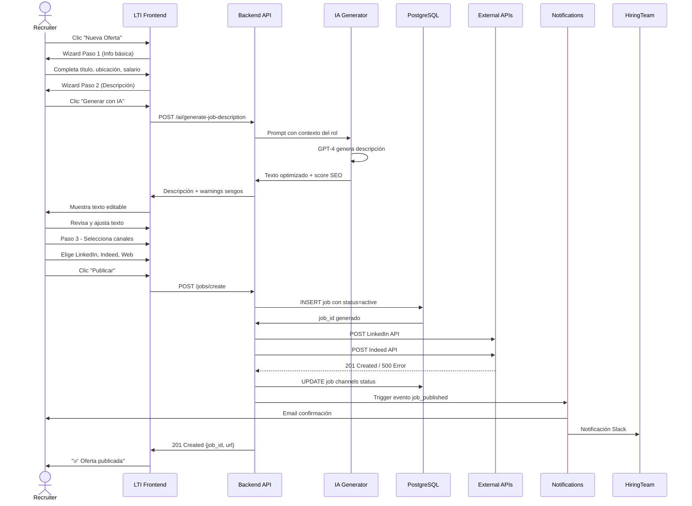
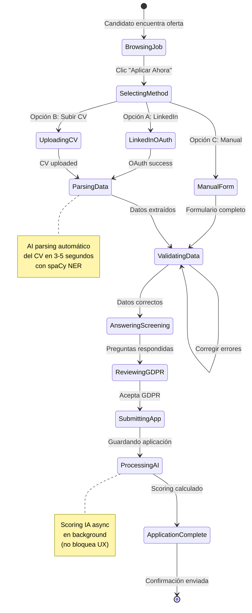
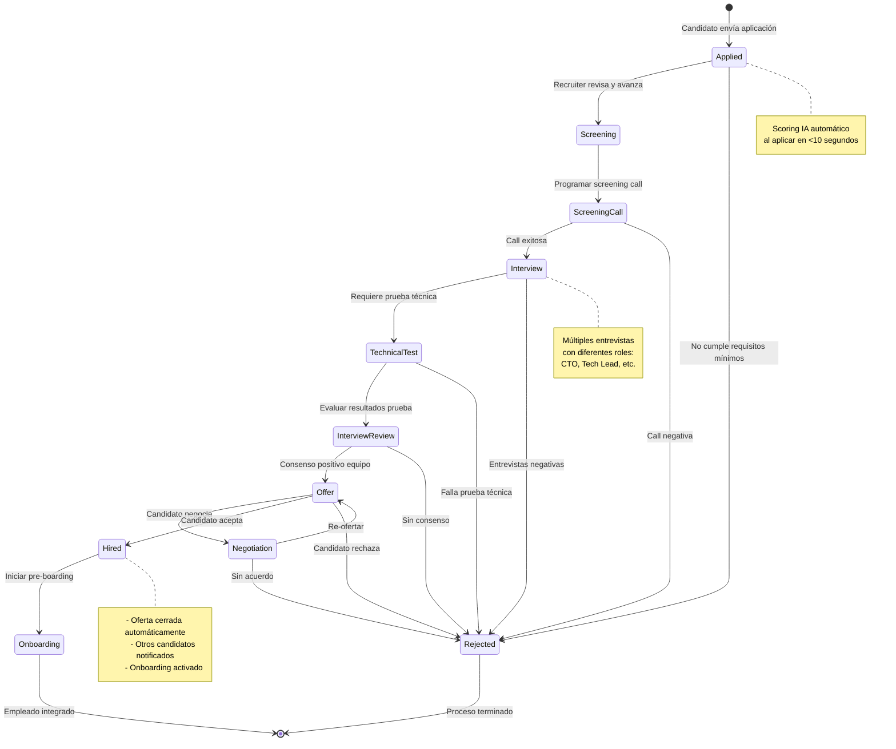
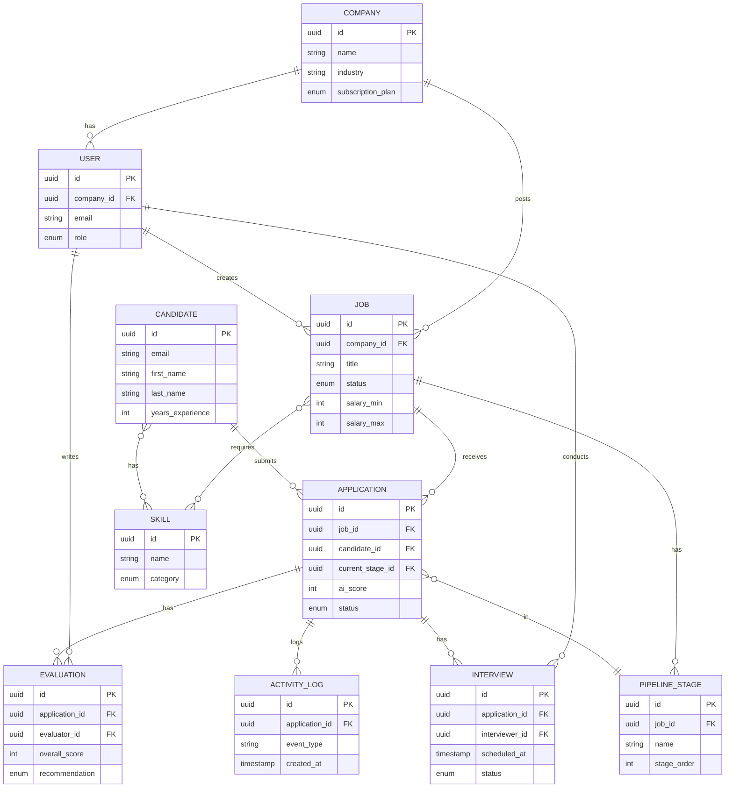
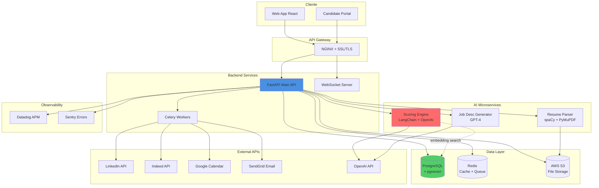
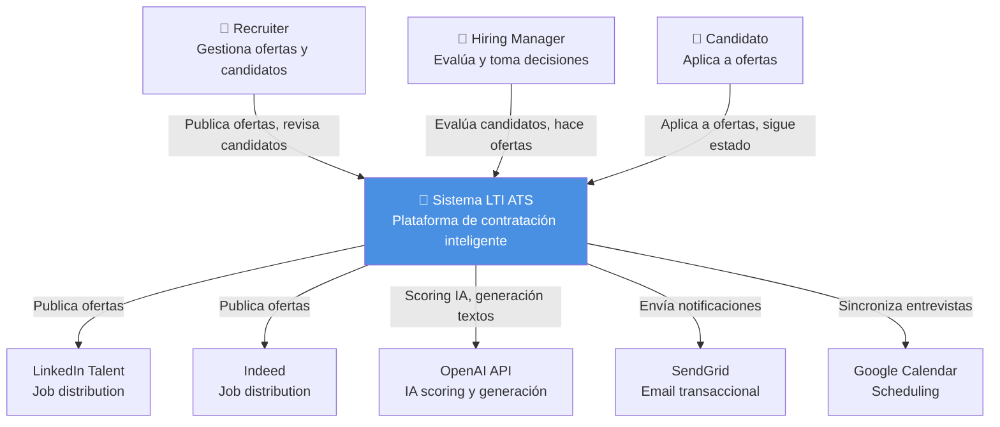
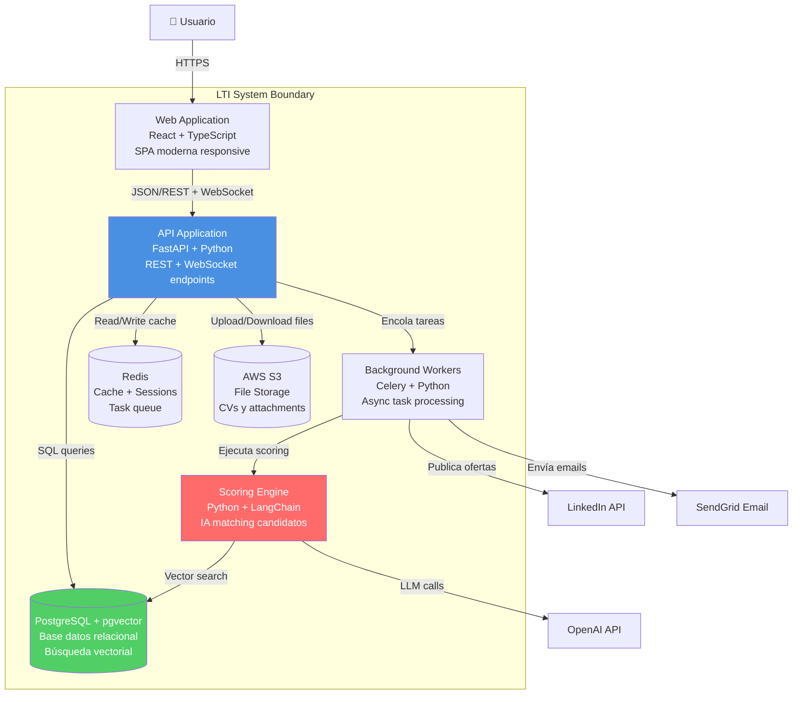
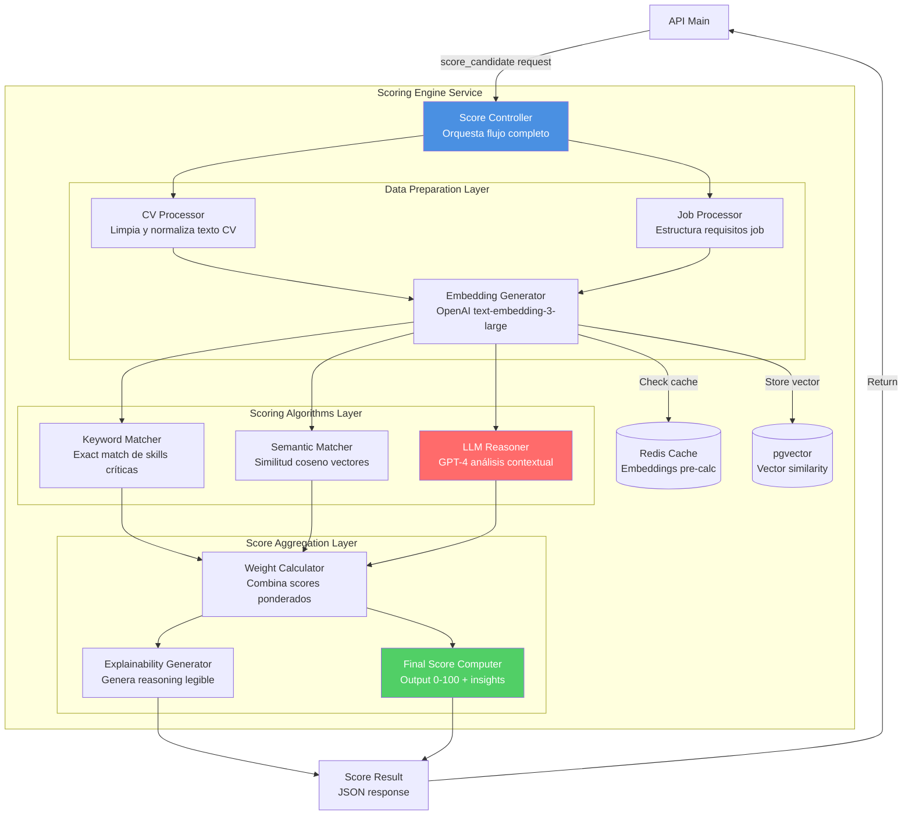

# Prompts Utilizados para Diseñar LTI ATS

**Autor**: AJM  

**Fecha**: 15 de noviembre de 2025  

**Proyecto**: LTI - Sistema ATS

Este documento contiene todos los prompts literales ejecutados en Cursor AI para generar el diseño completo del sistema LTI documentado en LTI-AJM.md. Cada prompt fue ejecutado en una ventana independiente de Cursor, por lo que incluye el contexto completo del proyecto para ser autocontenido.

---

## PROMPT 0: CONTEXTO INICIAL

Eres un arquitecto de software senior especializado en diseño de sistemas.

PROYECTO: LTI (Leading Talent Intelligence) - ATS del futuro

CONTEXTO COMPLETO:

Tipo: SaaS - Applicant Tracking System con IA

Target: Startups/scaleups tech 20-500 empleados

Problemas: Time-to-hire 45+ días, malas contrataciones, mala experiencia candidato

Diferenciadores: Matching semántico IA, automatización comunicaciones, colaboración tiempo real estilo Notion, scoring explicable, freemium PLG

Stack: React+TypeScript, FastAPI+Python, PostgreSQL+pgvector, OpenAI GPT-4, Celery+Redis, AWS S3

DOCUMENTO A GENERAR: LTI-AJM.md

ESTRUCTURA DEL DOCUMENTO:

Descripción del Software (análisis mercado, valor añadido, funciones)

Lean Canvas (9 bloques en tabla 2x5)

Casos de Uso Principales (3 casos detallados + diagramas Mermaid)

Modelo de Datos (entidades + ERD)

Diseño de Alto Nivel (arquitectura + diagrama)

Diagrama C4 (Context, Container, Component)

CONFIRMA que entendiste y estás listo para generar contenido en formato markdown profesional.

**Resultado**: Cursor confirmó comprensión del proyecto.

---

## PROMPT 1: SECCIÓN 1 - DESCRIPCIÓN DEL SOFTWARE

PROYECTO: LTI - ATS para startups tech 20-500 empleados
DOCUMENTO: LTI-AJM.md - SECCIÓN 1
ROL: Analista de mercado especializado en HR Tech y sistemas ATS

GENERA CONTENIDO MARKDOWN COMPLETO para la SECCIÓN 1 con esta estructura exacta:

LTI - Sistema ATS (Applicant Tracking System)

Autor: AJM

Fecha: 15 de noviembre de 2025

Versión: 1.0

Índice

Descripción del Software

Lean Canvas

Casos de Uso Principales

Modelo de Datos

Diseño de Alto Nivel

Diagrama C4

1. Descripción del Software
¿Qué es LTI?

[Genera 2-3 párrafos explicando:

LTI (Leading Talent Intelligence) es un ATS de nueva generación

Combina IA conversacional, automatización inteligente y colaboración en tiempo real

A diferencia de Greenhouse/Lever/Workable que son bases de datos de CVs con workflows rígidos, LTI actúa como copiloto inteligente

Entiende contexto (no solo keywords), automatiza comunicaciones manteniendo personalización, facilita colaboración estilo Notion/Linear]

Valor Añadido y Ventajas Competitivas
Problemas que Resuelve LTI

[Genera lista de 5 problemas con descripción breve cada uno:

Time-to-hire excesivo (45+ días)

Calidad de contratación baja (decisiones sin datos = bad hires 3x salario)

Mala experiencia del candidato (ghosting, falta transparencia)

Falta de colaboración (feedback disperso en emails)

Costes de recruiting altos (ATS desde 5.000€/año inaccesibles para early-stage)]

Diferenciadores Clave vs Competencia

[Genera tabla markdown con 6 filas comparando ATS Tradicionales vs LTI:]

Característica	ATS Tradicionales	LTI (Ventaja Competitiva)
Screening de CVs	Keyword matching rígido (busca "React" literal)	🤖 Matching semántico con LLM: entiende "NextJS + Vercel" como conocimiento React avanzado mediante embeddings y búsqueda vectorial
Comunicación candidatos	Emails plantilla genéricos enviados manualmente	✉️ IA generativa personalizada: cada email menciona específicamente skills relevantes del candidato y su experiencia
Colaboración equipo	Comentarios asincrónicos en interfaz anticuada	🧑‍🤝‍🧑 Workspace en tiempo real estilo Notion: mentions, threads, decisiones documentadas en contexto
Insights y métricas	Reportes PDF semanales estáticos sin acción	📊 Dashboard predictivo en tiempo real: "Esta oferta cerrará en 12 días con 85% de confianza"
Experiencia candidato	Portal básico sin visibilidad del proceso	💬 Chatbot IA 24/7 + portal transparente con estado actual y próximos pasos claros
Pricing	Desde 5.000€/año con contratos anuales obligatorios	💰 Freemium + pay-as-you-grow: desde 0€ hasta 299€/mes sin compromisos ni lock-in

Funciones Principales

[Genera 7 funciones numeradas, cada una con:

Título en negrita

Descripción de 2-3 líneas

3-4 bullets de capacidades específicas]

1. Gestión Inteligente de Ofertas

Creador de job descriptions con IA que optimiza para SEO y elimina sesgos de género/edad/origen

Publicación multicanal automatizada (LinkedIn, Indeed, InfoJobs, web corporativa) con un solo clic

A/B testing integrado de títulos y descripciones para maximizar aplicaciones de calidad

2. Pipeline Visual Personalizable

Kanban drag-and-drop con stages customizables por departamento (Applied → Screening → Interview → Offer → Hired)

Automatizaciones visuales tipo Zapier: "Si candidato no responde en 48h → mover a 'Descartado'"

Vista timeline con historial completo de interacciones por candidato

3. AI-Powered Candidate Screening

Parsing inteligente de CVs con NER (Named Entity Recognition) extrae skills, experiencia, educación automáticamente

Scoring 0-100 con explicabilidad: "Match 87/100 porque: Python (5 años) ✅, FastAPI (2 años) ✅, falta: Kubernetes ⚠️"

Preguntas de screening dinámicas generadas automáticamente según requisitos del rol

4. Calendario de Entrevistas Automático

Integración bidireccional Google Calendar/Outlook sincronizados en tiempo real

Self-scheduling: candidato selecciona slots disponibles, sistema confirma automáticamente

Recordatorios inteligentes 24h y 1h antes por email y SMS

Video entrevistas integradas (Zoom/Google Meet/Microsoft Teams embebido)

5. Evaluaciones Colaborativas Estructuradas

Templates por rol: "Entrevista técnica backend" con rubrica predefinida (technical skills, communication, problem solving)

Scoring calibrado garantiza consistencia entre evaluadores

Detección de sesgos: IA analiza comentarios buscando lenguaje sesgado sobre género, edad, origen

6. Analytics Predictivo

Time-to-hire por rol, departamento, seniority con benchmarks del sector

Quality of hire: correlación entre scoring inicial y performance real a 6/12 meses

Diversity metrics: distribución género, edad, origen en cada stage para detectar problemas de sesgo

Cost-per-hire: tracking completo de inversión por canal (LinkedIn Ads, referidos, job boards)

7. Integraciones Nativas

Job boards: LinkedIn Talent Solutions, Indeed Publisher, InfoJobs, Glassdoor

HRIS: BambooHR, Personio, Factorial (sincronización automática al contratar)

Assessment tools: HackerRank, Codility, TestGorilla para pruebas técnicas

Background checks: Certn, Checkr (lanzar verificación con un clic)

APIs abiertas: Webhooks y REST API para integraciones custom

FORMATO: Markdown profesional, headers bien jerarquizados (##, ###, ####), tabla bien formateada, bullets organizados, emojis para visual impact.

**Resultado**: Generó Sección 1 completa con encabezado, índice, descripción de LTI, problemas que resuelve, tabla comparativa de 6 diferenciadores y 7 funciones principales detalladas.

---

## PROMPT 2: SECCIÓN 2 - LEAN CANVAS

PROYECTO: LTI - ATS para startups tech
ARCHIVO: LTI-AJM.md (ya existe con Sección 1 completada)
ROL: Mentor de startup experto en Lean Canvas

TAREA:

ABRE el archivo LTI-AJM.md y AÑADE al final (después de la Sección 1) el contenido de la SECCIÓN 2: Lean Canvas.

CONTEXTO DEL PROYECTO:

LTI (Leading Talent Intelligence) - ATS con IA

Target: Startups tech 20-500 empleados

Diferenciadores: Matching semántico IA, automatización, colaboración tiempo real, scoring explicable, freemium

Stack: FastAPI+Python, React+TypeScript, PostgreSQL+pgvector, OpenAI GPT-4

CONTENIDO A AÑADIR:

2. Lean Canvas

Modelo de Negocio LTI

[Genera tabla markdown 2 filas x 5 columnas con:]

FILA 1:

| PROBLEM | SOLUTION | UNIQUE VALUE PROPOSITION | UNFAIR ADVANTAGE | CUSTOMER SEGMENTS |

Contenido Fila 1:

Problem: Top 3 problemas críticos con datos (time-to-hire 45+ días 87% menciones, bad hires 3x salario 71% no mide, 50% abandonos por mala experiencia)

Solution: Top 3 features (IA pre-filtra <5min ahorra 80% tiempo, scoring predictivo 10M+ data correlaciona con performance, portal transparente + chatbot reduce abandonos 70%)

UVP: "El ATS que contrata por ti" - Reduce time-to-hire 60% (6 sem → 2 sem) con IA que entiende talento en escala

Unfair Advantage: Algoritmo propietario matching semántico + dataset 10M+ CVs + 500K+ contrataciones + 3 años feedback humano = imposible replicar

Customer Segments: Primary (startups tech 20-500, 3-10 contrataciones/trimestre, budget <10K/año) + Secondary (agencias recruiting 5-20 consultores gestionan 20-50 procesos)

FILA 2:

| KEY METRICS | CHANNELS | COST STRUCTURE | REVENUE STREAMS |

Contenido Fila 2:

Key Metrics: North Star time-to-hire <15 días + Quality of hire >85% + Candidate NPS >50 + MAU + ARR + Automation >70% + Churn <5%

Channels: Adquisición (SEO inbound, LinkedIn Ads, PLG freemium, partnerships HRIS) + Retención (onboarding 30d, CS proactivo, academy)

Cost Structure: Fijos 60% (equipo €350K, infra €24K/año, support €80K, marketing €50K, legal €20K) + Variables 40% (APIs LLM €0.02/candidato, observabilidad €500/mes, CAC €300, emails €200/mes)

Revenue Streams: Free 0€ (1 user 3 ofertas), Starter 99€/mes (5 users 10 ofertas IA básica), Pro 299€/mes (ilimitado IA avanzada analytics), Enterprise custom desde 999€/mes (soporte dedicado SLA SSO)

INSTRUCCIONES:

Abre LTI-AJM.md

Ve al final de la Sección 1

Añade el contenido de arriba con formato markdown profesional

Usa emojis (1-2 por bullet)

Tabla bien formateada y alineada

Números concretos (€, %, días)

Guarda el archivo automáticamente

CONFIRMA cuando hayas añadido el contenido al archivo.

**Resultado**: Añadió Sección 2 con tabla Lean Canvas 2x5 completa con los 9 bloques del modelo.

---

## PROMPT 3: CASOS DE USO - IDENTIFICACIÓN

PROYECTO: LTI - ATS con IA para startups tech
ARCHIVO: LTI-AJM.md (ya contiene Sección 1 y 2)
ROL: Analista de sistemas experto en UML y casos de uso

TAREA:

ABRE el archivo LTI-AJM.md y AÑADE al final el inicio de la SECCIÓN 3: Casos de Uso Principales.

FUNCIONALIDADES DEL SISTEMA LTI:

Gestión inteligente de ofertas con IA (job description generator, detección sesgos)

Pipeline visual personalizable (Kanban drag-drop, automatizaciones)

Screening candidatos con scoring IA explicable (0-100 con reasoning)

Calendario entrevistas automático (integración Google/Outlook)

Evaluaciones colaborativas estructuradas (templates, calibración)

Analytics predictivo (time-to-hire, quality of hire, diversity metrics)

CONTENIDO A AÑADIR AL ARCHIVO:

3. Casos de Uso Principales

Los siguientes casos de uso cubren los flujos críticos del sistema LTI, demostrando las capacidades diferenciadoras de IA, automatización y colaboración en tiempo real. Se han seleccionado para representar los tres actores principales (recruiter, candidato, hiring manager) y los procesos más relevantes del ciclo de contratación.

Identificación de Casos de Uso

Los 3 casos de uso más críticos que documentamos son:

1. Publicar Oferta de Empleo

Actor: Recruiter / Hiring Manager

Justificación: Es el punto de entrada del sistema y el primer contacto con la propuesta de valor. Demuestra la capacidad de IA generativa para crear job descriptions optimizadas y la detección automática de sesgos, reduciendo el time-to-publish de horas a minutos. Sin ofertas publicadas, no hay candidatos en el pipeline.

Complejidad técnica: Media (integración con múltiples job boards, IA generativa, validaciones)

2. Aplicar a Oferta (Experiencia Candidato)

Actor: Candidato externo

Justificación: La experiencia del candidato es crítica para el employer brand y la tasa de conversión. Este caso de uso demuestra el parsing inteligente de CVs con NER, el scoring automático con IA explicable, y la reducción de fricción en el proceso de aplicación. El 50% de candidatos abandona procesos complejos, por lo que optimizar este flujo es fundamental.

Complejidad técnica: Media-Alta (parsing CVs múltiples formatos, scoring IA en tiempo real, manejo de errores)

3. Evaluar y Avanzar Candidatos en Pipeline

Actor: Recruiter / Hiring Manager / Interviewer

Justificación: Core del ATS. Gestiona todo el proceso de evaluación colaborativa, desde el screening inicial hasta la oferta final. Demuestra la capacidad de colaboración en tiempo real estilo Notion, scoring combinado (IA + humano), y automatizaciones inteligentes para avanzar candidatos. Es el flujo más complejo y el que más tiempo ahorra a los equipos de hiring.

Complejidad técnica: Alta (múltiples actores, estados del pipeline, integraciones calendario, evaluaciones estructuradas)

A continuación se detalla cada caso de uso con su flujo principal, flujos alternativos y diagramas correspondientes.

INSTRUCCIONES:

Abre LTI-AJM.md

Ve al final de la Sección 2 (Lean Canvas)

Añade el contenido de arriba

Mantén formato markdown profesional con headers ### y ####

Guarda el archivo automáticamente

CONFIRMA cuando hayas añadido el contenido al archivo.

**Resultado**: Añadió inicio de Sección 3 con identificación de los 3 casos de uso críticos.

---

## PROMPT 4: CASO DE USO 1 DETALLADO + DIAGRAMA

PROYECTO: LTI - ATS para startups tech
ARCHIVO: LTI-AJM.md (contiene Secciones 1, 2 y 3 parcial)
ROL: Analista de sistemas usando metodología casos de uso estructurados

TAREA:

ABRE LTI-AJM.md y AÑADE el detalle completo del CASO DE USO 1: Publicar Oferta de Empleo.

CONTEXTO:

Stack: FastAPI+Python backend, React+TypeScript frontend, OpenAI GPT-4 para generación

Funcionalidad: Crear ofertas con IA generativa, detectar sesgos, publicar en múltiples canales (LinkedIn, Indeed, web)

CONTENIDO A AÑADIR AL ARCHIVO:

Caso de Uso 1: Publicar Oferta de Empleo
Actor: Recruiter / Hiring Manager

Objetivo: Crear y publicar una oferta de empleo optimizada en múltiples canales con mínimo esfuerzo manual

Precondiciones:

Usuario autenticado con rol de Recruiter o Admin

Cuenta activa con créditos de publicación disponibles según plan suscrito

Empresa tiene al menos 1 departamento configurado en el sistema

Flujo Principal:

Recruiter hace clic en botón "+ Nueva Oferta" desde el dashboard principal

Sistema muestra wizard de creación con 3 pasos claramente definidos

Paso 1 - Información Básica:

Recruiter completa: título del rol, departamento, ubicación, tipo de contrato (full-time/part-time/contract), rango salarial

Sistema valida campos obligatorios en tiempo real

Paso 2 - Descripción del Rol:

Recruiter puede elegir entre:

Opción A: Escribir manualmente responsabilidades, requisitos y benefits

Opción B: Usar "Generador IA" proporcionando inputs básicos (rol, seniority, 3-5 skills clave)

Si elige Opción B (Generador IA):

Sistema envía prompt a GPT-4: "Genera job description para [rol] senior con experiencia en [skills]"

IA genera en 10-15 segundos: descripción optimizada SEO, estructura moderna, lenguaje inclusivo

Sistema ejecuta detector de sesgos sobre el texto generado

Si detecta términos problemáticos ("joven", "nativo", "dinámico"), subraya y sugiere alternativas

Recruiter revisa y edita el texto generado según necesidad

Paso 3 - Canales de Publicación:

Sistema muestra opciones: ☑️ Web corporativa, ☑️ LinkedIn, ☑️ Indeed, ☑️ InfoJobs

Recruiter selecciona canales deseados

Sistema muestra preview lado a lado de cómo se verá la oferta en cada canal seleccionado

Sistema ejecuta validaciones finales:

⚠️ "Falta rango salarial: ofertas con salario reciben 3x más aplicaciones de calidad"

⚠️ "Detectado posible lenguaje sesgado en requisitos: revisar término 'rockstar'"

Recruiter confirma y hace clic en "Publicar Oferta"

Sistema ejecuta en paralelo:

Crea oferta en base de datos con estado "active"

Genera pipeline con stages por defecto: Applied → Screening → Interview → Offer → Hired

Publica en canales seleccionados mediante sus APIs respectivas

Genera URL única de aplicación: lti.jobs/senior-backend-engineer-madrid-xyz123

Configura notificaciones automáticas para equipo de hiring

Sistema muestra confirmación: "✅ Oferta publicada exitosamente en 3 canales. 🔗 Ver oferta pública"

Flujos Alternativos:

5a - IA detecta lenguaje sesgado en descripción manual: Sistema subraya palabras como "nativo", "joven", "agresivo" y sugiere alternativas neutrales ("fluent", "experienced", "results-driven")

9a - Validación falla por campos obligatorios incompletos: Sistema bloquea botón "Publicar", marca campos en rojo y muestra tooltip con el error específico

11a - API de canal externo falla temporalmente: Sistema publica en canales disponibles, marca LinkedIn como "pendiente", muestra mensaje "⚠️ LinkedIn temporalmente no disponible, reintentaremos automáticamente en 5 min" y programa retry en background

11b - Usuario en plan Free supera límite de 3 ofertas activas: Sistema bloquea publicación y muestra modal de upgrade: "Has alcanzado el límite de 3 ofertas activas en plan Free. Upgrade a Starter (€99/mes) para publicar hasta 10 ofertas simultáneas. [Ver planes]"

Postcondiciones:

Oferta visible públicamente en todos los canales seleccionados

Pipeline de candidatos creado y listo para recibir aplicaciones

Página de aplicación accesible vía URL pública sin autenticación

Equipo de hiring notificado por email y/o Slack según configuración

Oferta aparece en dashboard de recruiter con estado "Activa" y contador de aplicaciones en 0

Diagrama de Secuencia:



INSTRUCCIONES:

Abre LTI-AJM.md

Busca la sección donde terminó la identificación de casos de uso

Añade el contenido completo del Caso de Uso 1 de arriba

Asegúrate que el diagrama Mermaid esté correctamente formateado con triple backtick

Guarda el archivo automáticamente

CONFIRMA cuando hayas añadido el Caso de Uso 1 completo con diagrama.

**Resultado**: Añadió Caso de Uso 1 completo con 12 pasos del flujo principal, 4 flujos alternativos y diagrama de secuencia Mermaid.

---

## PROMPT 5: CASO DE USO 2 DETALLADO + DIAGRAMA

PROYECTO: LTI - ATS para startups tech
ARCHIVO: LTI-AJM.md (contiene Secciones 1, 2, 3 con Caso de Uso 1)
ROL: Analista de sistemas usando metodología casos de uso estructurados

TAREA:

ABRE LTI-AJM.md y AÑADE el detalle completo del CASO DE USO 2: Aplicar a Oferta (Experiencia Candidato).

CONTEXTO:

Stack: React frontend, FastAPI backend, Celery workers para parsing, OpenAI para scoring, AWS S3 para CVs

Funcionalidad: Parsing automático de CVs con NER, scoring IA en tiempo real, portal transparente para candidatos

CONTENIDO A AÑADIR AL ARCHIVO:

Caso de Uso 2: Aplicar a Oferta (Experiencia Candidato)
Actor: Candidato externo

Objetivo: Aplicar a una oferta de empleo de forma rápida, sin fricción y recibiendo confirmación inmediata del estado de su aplicación

Precondiciones:

Oferta publicada con estado "active" en sistema

URL pública de aplicación accesible sin autenticación

Candidato tiene CV en formato digital (PDF, DOCX) o perfil público de LinkedIn

Flujo Principal:

Candidato encuentra oferta navegando en LinkedIn, Indeed o web corporativa de LTI

Hace clic en call-to-action "Aplicar Ahora"

Sistema redirige a página dedicada de aplicación de LTI mostrando:

Descripción completa del rol con formato legible

Información de la empresa (logo, descripción, cultura, benefits)

Indicador de tiempo estimado: "⏱️ 2 minutos para completar aplicación"

Sistema presenta 3 opciones de aplicación para reducir fricción:

Opción A: 🔗 "Aplicar con LinkedIn" (OAuth, importación automática de perfil)

Opción B: 📄 "Subir CV" (drag & drop o selector de archivos)

Opción C: ✍️ "Rellenar formulario manualmente"

Candidato elige Opción B y arrastra su CV en formato PDF al área designada

Sistema sube CV a S3 y lanza parsing automático en background:

Worker de Celery procesa PDF con PyMuPDF + spaCy NER

Extrae información estructurada:

Datos personales: nombre completo, email, teléfono, ubicación

Experiencia laboral: array de {empresa, rol, fechas_inicio_fin, descripción}

Educación: {universidad, título, año_graduación}

Skills técnicas: detecta y normaliza tecnologías mencionadas (Python → python, React.js → react)

Sistema muestra formulario pre-rellenado en 3-5 segundos:

✅ Nombre: Ana García Martínez
✅ Email: ana.garcia@example.com
✅ Teléfono: +34 600 123 456
✅ Ubicación: Madrid, España
✅ Años experiencia total: 5 años
✅ Skills detectadas: Python, FastAPI, PostgreSQL, Docker, AWS

Candidato valida o corrige información si el parsing tuvo errores (ej: teléfono mal extraído)

Sistema muestra preguntas de screening configuradas por el recruiter:

Pregunta 1: "¿Tienes experiencia con arquitecturas de microservicios en producción?" [Sí / No]

Pregunta 2: "¿Cuál es tu expectativa salarial bruta anual?" [Range slider: 30K - 80K €]

Pregunta 3: "¿Disponibilidad para empezar?" [Inmediata / 15 días / 1 mes / Negociar]

Candidato opcionalmente puede añadir carta de presentación en textarea (máx 500 palabras)

Candidato marca checkbox obligatorio: "☑️ He leído y acepto la política de privacidad y tratamiento de datos (GDPR compliant)"

Candidato hace clic en botón "Enviar Aplicación"

Sistema procesa aplicación:

Guarda registro en tabla applications con estado "applied"

Almacena CV original en S3 con encriptación

Encola job async para scoring IA:

Worker genera embeddings del CV con OpenAI text-embedding-3-large

Calcula similitud semántica con job description

Ejecuta prompt GPT-4 para scoring contextual: "Evalúa match candidato-job: [CV] vs [Requirements]"

Combina scores (keyword matching + semantic + LLM) con pesos para score final 0-100

Añade candidato a pipeline en stage "Applied"

Envía email de confirmación a candidato con SendGrid

Si score IA > 70 (candidato prometedor), notifica al recruiter inmediatamente vía email/Slack

Candidato ve pantalla de confirmación:

✅ ¡Aplicación enviada exitosamente!

Gracias por tu interés en [Empresa] para el rol de [Título].

📧 Te hemos enviado un email de confirmación a ana.garcia@example.com

⏱️ Nuestro equipo revisará tu perfil y te responderemos en máximo 5 días laborables.

🔗 Puedes seguir el estado de tu aplicación en tiempo real aquí:

https://lti.jobs/application/track/ABC123XYZ

💬 ¿Tienes preguntas? Nuestro chatbot está disponible 24/7 para ayudarte.

Candidato recibe email de confirmación en menos de 1 minuto con:

Resumen de su aplicación (rol, empresa, fecha)

Próximos pasos esperados en el proceso

Link al portal de seguimiento con token único

Contacto de soporte en caso de dudas

Flujos Alternativos:

5a - Candidato elige Opción A (LinkedIn): Sistema redirige a OAuth de LinkedIn → candidato autoriza → sistema importa datos perfil (nombre, email, headline, experiencia, educación, skills) → salta al paso 7 con formulario pre-rellenado

6a - Parsing falla por formato no soportado: Si CV es imagen escaneada, tabla compleja o formato corrupto, sistema muestra mensaje: "⚠️ No pudimos leer tu CV automáticamente. Por favor completa el formulario manualmente" → redirige a Opción C

9a - Candidato no responde pregunta de screening obligatoria: Sistema deshabilita botón "Enviar Aplicación", marca pregunta sin responder en rojo con asterisco * y muestra tooltip: "⚠️ Esta pregunta es obligatoria para continuar"

11a - Email ya existe en sistema (aplicación duplicada): Sistema detecta email duplicado para la misma oferta y muestra modal: "Ya aplicaste a esta oferta el 10/11/2025. ¿Quieres actualizar tu aplicación con un nuevo CV? [Actualizar CV] [Ver mi aplicación] [Cancelar]"

13a - Scoring IA falla por timeout de OpenAI: Sistema guarda aplicación sin score, asigna valor null, marca para review manual prioritario, y envía alerta a equipo técnico para debugging del servicio de IA

Postcondiciones:

Candidato registrado en sistema con datos estructurados y normalizados

CV original almacenado en S3 con path referenciado en BD

Aplicación creada en stage "Applied" del pipeline de la oferta

Scoring IA calculado y almacenado (o marcado para retry si falló)

Emails de confirmación enviados tanto a candidato como a recruiter

Timeline del candidato inicializado con primer evento "application_submitted" timestamp

Métricas actualizadas: contador de aplicaciones de la oferta +1

Diagrama de Estados:



INSTRUCCIONES:

Abre LTI-AJM.md

Busca el final del Caso de Uso 1

Añade el contenido completo del Caso de Uso 2 de arriba

Asegúrate que el diagrama de estados Mermaid esté correctamente formateado

Guarda el archivo automáticamente

CONFIRMA cuando hayas añadido el Caso de Uso 2 completo con diagrama.

**Resultado**: Añadió Caso de Uso 2 completo con 15 pasos, 5 flujos alternativos y diagrama de estados Mermaid.

---

## PROMPT 6: CASO DE USO 3 DETALLADO + DIAGRAMA

PROYECTO: LTI - ATS para startups tech
ARCHIVO: LTI-AJM.md (contiene Secciones 1, 2, 3 con Casos de Uso 1 y 2)
ROL: Analista de sistemas usando metodología casos de uso estructurados

TAREA:

ABRE LTI-AJM.md y AÑADE el detalle completo del CASO DE USO 3: Evaluar y Avanzar Candidatos en Pipeline.

CONTEXTO:

Stack: React Kanban UI, FastAPI backend, PostgreSQL pipeline stages, integración Google Calendar

Funcionalidad: Vista Kanban con scoring IA, evaluaciones estructuradas, colaboración tiempo real, decisiones documentadas

CONTENIDO A AÑADIR AL ARCHIVO:

Caso de Uso 3: Evaluar y Avanzar Candidatos en Pipeline
Actor: Recruiter, Hiring Manager, Interviewer

Objetivo: Revisar candidatos de forma eficiente, evaluar con criterio consistente usando scoring IA y feedback estructurado, y tomar decisiones informadas para avanzarlos en el proceso de selección

Precondiciones:

Al menos 1 candidato en pipeline de una oferta activa

Usuario con permisos de evaluación (role: recruiter, hiring_manager, o interviewer asignado)

Pipeline configurado con stages y criterios de evaluación definidos

Flujo Principal:

Recruiter accede a sección "Pipeline" desde menú principal de navegación

Selecciona oferta específica del dropdown: "Senior Backend Engineer - Madrid"

Sistema muestra vista Kanban con columnas representando stages del proceso:

[Applied: 45]  [Screening: 12]  [Interview: 5]  [Offer: 1]  [Hired: 0]  [Rejected: 89]

Dentro de cada columna, candidatos están ordenados por scoring IA descendente (score 100 arriba, score 0 abajo) para priorizar revisión

Cada card de candidato muestra información clave de un vistazo:

📸 Avatar (foto de LinkedIn o iniciales)

👤 Nombre completo

⭐ Score IA: 87/100 (tamaño grande, color verde si >80, amarillo 60-80, rojo <60)

🎯 Top 3 skills que matchean con requisitos

⏱️ Tiempo en stage actual: "2 días en Applied"

💬 Contador de comentarios internos: "3 comentarios"

Recruiter hace clic en card de candidato destacado: "Ana García - Score 87/100"

Sistema abre panel lateral detallado (slide-in desde derecha) con tabs organizados:

📋 Tab "Overview": Datos personales, experiencia, educación, skills, botón "Descargar CV"

🤖 Tab "AI Insights": Score 87/100, fortalezas identificadas, áreas a validar, preguntas sugeridas para entrevista

📅 Tab "Activity Timeline": Línea temporal de todas las interacciones (aplicó, scoring calculado, emails enviados, visto por recruiter, comentarios)

💬 Tab "Team Feedback": Espacio colaborativo estilo Notion con @mentions, evaluaciones post-entrevista, hilos de discusión

Después de revisar el perfil completo, recruiter decide avanzar candidato al siguiente stage

Recruiter arrastra card de Ana desde columna "Applied" hacia columna "Screening" (drag & drop visual con animación)

Sistema muestra modal de confirmación y acciones:

⏩ Avanzar a "Screening": Ana García

¿Qué acciones automáticas ejecutar?

✅ Enviar email al candidato notificando progreso con próximos pasos
✅ Crear tarea en tu to-do: "Realizar screening call con Ana García"
✅ Actualizar métrica time-in-stage para analytics

Opciones adicionales:

[📝 Personalizar email antes de enviar]  [📞 Programar llamada ahora]

[Cancelar]  [Confirmar y Avanzar ✓]

Recruiter hace clic en "Programar llamada ahora" para agendar screening call

Sistema abre interfaz de calendario integrado:

Muestra disponibilidad del recruiter sincronizada con Google Calendar en tiempo real

Genera link Calendly embebido donde Ana podrá seleccionar slot disponible

Sistema envía email a Ana con link de scheduling

Una vez Ana confirma, evento se crea automáticamente en ambos calendarios

Sistema programa recordatorios automáticos: email 24h antes + email 1h antes + SMS 1h antes

Screening call se realiza en la fecha acordada (30 minutos de duración)

Inmediatamente después de la llamada, recruiter vuelve al perfil de Ana en LTI

Recruiter hace clic en botón "+ Añadir Evaluación" dentro del perfil

Sistema muestra formulario de evaluación estructurado con template "Screening Call":

📋 Evaluación: Screening Call
Evaluador: Juan Pérez (tú)
Fecha: 15/11/2025 10:00
Duración real: 35 min

CRITERIOS DE EVALUACIÓN (escala 1-5):

1. Experiencia Técnica: ⭐⭐⭐⭐⭐ (5/5)
2. Habilidades de Comunicación: ⭐⭐⭐⭐☆ (4/5)
3. Fit Cultural con empresa: ⭐⭐⭐⭐⭐ (5/5)
4. Motivación e interés por el rol: ⭐⭐⭐⭐☆ (4/5)
5. Expectativas salariales alineadas: ⭐⭐⭐⭐⭐ (5/5)

COMENTARIOS DETALLADOS: [Textarea]

RECOMENDACIÓN FINAL:
• ✅ Avanzar (fuertemente recomendado)
• ⚠️ Dudoso (requiere más evaluación)
• ❌ Rechazar

Recruiter selecciona "✅ Avanzar" y guarda la evaluación

Sistema procesa la evaluación positiva:

Actualiza score global de Ana: 87 → 92 (evaluación humana positiva incrementa score combinando IA + human judgment)

Almacena evaluación en tabla evaluations con timestamp

Añade evento a activity timeline de Ana

Recruiter ahora arrastra card de Ana desde "Screening" → "Interview"

Sistema automáticamente:

Asigna interviewers según configuración de la oferta: CTO (entrevista técnica) + Tech Lead (pair programming)

Envía email a Ana: "¡Buenas noticias! Has pasado el screening. Próximos pasos: 2 entrevistas técnicas. Selecciona tu disponibilidad aquí: [Link]"

Envía email a interviewers (CTO + Tech Lead) con perfil completo de Ana, scoring, evaluación de screening, preguntas sugeridas por IA

Crea automáticamente template de evaluación técnica pre-configurado en sistema

En los días siguientes, se realizan 2 entrevistas técnicas. Cada interviewer completa su evaluación en sistema usando formulario estructurado

Hiring Manager (CTO en este caso) accede al perfil de Ana días después para tomar decisión final

En Tab "Team Feedback" del perfil, Hiring Manager ve todas las evaluaciones agregadas con scores y comentarios de cada interviewer

Basándose en el consenso positivo del equipo, Hiring Manager toma decisión: "Hacer oferta"

Hiring Manager arrastra card de Ana al stage "Offer"

Sistema muestra "Offer Builder" - herramienta para generar oferta formal con campos pre-rellenados (salario, benefits, fecha inicio) y vista previa del contrato en PDF

Hiring Manager completa los campos y hace clic en "Generar y Enviar Oferta"

Sistema genera PDF de oferta formal y envía email a Ana con oferta adjunta, link para aceptar/rechazar online con firma digital, y plazo de respuesta 7 días

Ana revisa la oferta, está satisfecha con condiciones, y acepta la oferta desde el portal

Sistema al detectar aceptación automáticamente:

Mueve card de Ana a stage "Hired" ✅ (confetti animation)

Notifica a todo el equipo de hiring vía email + Slack: "🎉 Ana García aceptó la oferta!"

Actualiza métricas del proceso: Time-to-hire: 32 días, Cost-per-hire: €450, Conversion rates por stage

Cierra automáticamente la oferta (cambia status a "closed", deja de aceptar nuevas aplicaciones)

Envía emails de rechazo automáticos y personalizados a todos los candidatos restantes en el pipeline

Inicia workflow de onboarding (si integración con HRIS configurada): crea perfil de Ana en BambooHR/Personio

Flujos Alternativos:

7a - Candidato con scoring bajo (<40): Sistema muestra banner destacado: "🤖 IA recomienda rechazo automático por bajo match técnico. ¿Revisar manualmente de todos modos?" con botones [Rechazar automáticamente] [Revisar perfil]

10a - Candidato no responde invitación en 48h: Sistema envía reminder automático por email. Si tras 5 días sin respuesta, sistema mueve automáticamente a sub-stage "Unresponsive" (dentro de Rejected) y notifica a recruiter

21a - Evaluadores en fuerte desacuerdo: Si un interviewer pone ⭐⭐⭐⭐⭐ (5/5) y otro ⭐⭐☆☆☆ (2/5), sistema detecta discrepancia y requiere calibración: Hiring Manager debe convocar reunión de calibración, revisar ambas evaluaciones, y tomar decisión final documentando el razonamiento del desempate

29a - Candidato rechaza la oferta: Ana hace clic en "Rechazar oferta" y sistema muestra formulario opcional: "¿Puedes compartir el motivo?" Sistema mueve a "Rejected" con reason "Candidate declined offer". Hiring Manager puede decidir: [Cerrar proceso] o [Re-ofertar con mejores condiciones]

30a - Proceso cancelado por empresa: Si empresa decide no cubrir el puesto, sistema permite "Cancelar oferta" masivamente, notificando a todos los candidatos activos del pipeline con mensaje transparente

Postcondiciones:

Candidato movido correctamente al stage correspondiente en el pipeline

Activity timeline actualizado con todas las acciones, decisiones y timestamps

Evaluaciones almacenadas en BD y agregadas en score global del candidato

Notificaciones enviadas a todas las partes relevantes (candidato, equipo interno, stakeholders)

Métricas del proceso de hiring actualizadas en tiempo real en dashboard de analytics

Si hired: oferta marcada como closed, onboarding iniciado automáticamente, candidatos restantes notificados

Diagrama de Máquina de Estados del Pipeline:



INSTRUCCIONES:

Abre LTI-AJM.md

Busca el final del Caso de Uso 2

Añade el contenido completo del Caso de Uso 3 de arriba

Asegúrate que el diagrama de máquina de estados Mermaid esté correctamente formateado con notas

Guarda el archivo automáticamente

CONFIRMA cuando hayas añadido el Caso de Uso 3 completo con diagrama.

**Resultado**: Añadió Caso de Uso 3 completo con 30 pasos del flujo principal, 5 flujos alternativos y diagrama de máquina de estados del pipeline.

---

## PROMPT 7: MODELO DE DATOS - ENTIDADES Y ERD

PROYECTO: LTI - ATS para startups tech
ARCHIVO: LTI-AJM.md (contiene Secciones 1, 2 y 3 completas)
ROL: Arquitecto de bases de datos especializado en PostgreSQL y sistemas transaccionales

TAREA:

ABRE LTI-AJM.md y AÑADE la SECCIÓN 4: Modelo de Datos con todas las entidades del sistema y el diagrama ERD.

CONTEXTO:

Base de datos: PostgreSQL 15 con extensión pgvector para búsqueda semántica

Principios: Normalización 3NF, evitar redundancia, índices optimizados

Casos de uso a soportar: Publicar ofertas, aplicar candidatos, evaluar pipeline

CONTENIDO A AÑADIR AL ARCHIVO:

4. Modelo de Datos
Entidades Principales del Sistema

El modelo de datos de LTI sigue principios de normalización (3NF) para evitar redundancia, con índices optimizados para queries frecuentes y búsqueda vectorial mediante pgvector.

1. Company

Representa la empresa cliente que usa LTI para sus procesos de hiring.

```
id: UUID (PK)
name: VARCHAR(255) NOT NULL
website: VARCHAR(255)
logo_url: VARCHAR(500)
industry: VARCHAR(100)
company_size: ENUM('1-10', '11-50', '51-200', '201-500', '500+')
subscription_plan: ENUM('free', 'starter', 'pro', 'enterprise')
subscription_status: ENUM('active', 'cancelled', 'past_due')
created_at: TIMESTAMP
updated_at: TIMESTAMP
```

Relaciones: 1 Company tiene N Users, N Jobs

2. User

Usuarios internos del sistema (recruiters, hiring managers, interviewers).

```
id: UUID (PK)
company_id: UUID (FK → Company)
email: VARCHAR(255) UNIQUE NOT NULL
password_hash: VARCHAR(255)
first_name: VARCHAR(100)
last_name: VARCHAR(100)
role: ENUM('admin', 'recruiter', 'hiring_manager', 'interviewer')
is_active: BOOLEAN
created_at: TIMESTAMP
```

Índices: idx_user_email en (email), idx_user_company en (company_id, is_active)

3. Job

Ofertas de empleo publicadas.

```
id: UUID (PK)
company_id: UUID (FK → Company)
created_by_user_id: UUID (FK → User)
title: VARCHAR(255)
department: VARCHAR(100)
location: VARCHAR(255)
remote_policy: ENUM('onsite', 'hybrid', 'remote')
employment_type: ENUM('full_time', 'part_time', 'contract')
seniority: ENUM('junior', 'mid', 'senior', 'lead')
salary_min: INTEGER
salary_max: INTEGER
description: TEXT
requirements: TEXT
status: ENUM('draft', 'active', 'paused', 'closed')
published_at: TIMESTAMP
created_at: TIMESTAMP
```

4. Candidate

Candidatos que aplican a ofertas.

```
id: UUID (PK)
email: VARCHAR(255) UNIQUE NOT NULL
first_name: VARCHAR(100)
last_name: VARCHAR(100)
phone: VARCHAR(50)
location: VARCHAR(255)
linkedin_url: VARCHAR(500)
years_experience: INTEGER
resume_url: VARCHAR(500)
resume_text: TEXT
created_at: TIMESTAMP
```

Índices: idx_candidate_email UNIQUE, idx_candidate_resume_fulltext USING GIN(to_tsvector('english', resume_text))

5. Application

Aplicación de un candidato a un job específico.

```
id: UUID (PK)
job_id: UUID (FK → Job)
candidate_id: UUID (FK → Candidate)
current_stage_id: UUID (FK → PipelineStage)
ai_score: INTEGER CHECK(ai_score >= 0 AND ai_score <= 100)
ai_reasoning: TEXT
cover_letter: TEXT
status: ENUM('active', 'hired', 'rejected', 'withdrawn')
applied_at: TIMESTAMP
hired_at: TIMESTAMP
rejected_at: TIMESTAMP
```

Índices: idx_application_job en (job_id, status), idx_application_score en (job_id, ai_score DESC), UNIQUE (job_id, candidate_id)

6. PipelineStage

Stages del pipeline de hiring (Applied, Screening, Interview, Offer, Hired).

```
id: UUID (PK)
job_id: UUID (FK → Job)
name: VARCHAR(100)
stage_order: INTEGER
stage_type: ENUM('applied', 'screening', 'interview', 'offer', 'hired', 'rejected')
created_at: TIMESTAMP
```

7. Evaluation

Evaluaciones de candidatos por parte del equipo.

```
id: UUID (PK)
application_id: UUID (FK → Application)
evaluator_id: UUID (FK → User)
stage_id: UUID (FK → PipelineStage)
type: ENUM('screening_call', 'technical_interview', 'cultural_fit')
overall_score: INTEGER (1-5)
criteria_scores: JSONB
comments: TEXT
recommendation: ENUM('strong_yes', 'yes', 'maybe', 'no', 'strong_no')
created_at: TIMESTAMP
```

8. Skill

Catálogo de skills técnicas y soft skills.

```
id: UUID (PK)
name: VARCHAR(100) UNIQUE
category: ENUM('language', 'framework', 'tool', 'soft_skill')
```

9. CandidateSkill (M-N)

Relación muchos a muchos entre candidatos y skills.

```
candidate_id: UUID (FK → Candidate)
skill_id: UUID (FK → Skill)
proficiency: ENUM('beginner', 'intermediate', 'advanced', 'expert')
years_experience: INTEGER
```

10. JobSkill (M-N)

Relación muchos a muchos entre jobs y skills requeridas.

```
job_id: UUID (FK → Job)
skill_id: UUID (FK → Skill)
required: BOOLEAN
importance: INTEGER (1-5)
```

11. Interview

Entrevistas programadas.

```
id: UUID (PK)
application_id: UUID (FK → Application)
interviewer_id: UUID (FK → User)
type: ENUM('phone_screen', 'technical', 'cultural', 'final')
scheduled_at: TIMESTAMP
duration_minutes: INTEGER
status: ENUM('scheduled', 'completed', 'cancelled', 'no_show')
notes: TEXT
```

12. ActivityLog

Log de todas las actividades del candidato en el proceso.

```
id: UUID (PK)
application_id: UUID (FK → Application)
user_id: UUID (FK → User, nullable)
event_type: VARCHAR(100)
event_data: JSONB
created_at: TIMESTAMP
```

Diagrama Entidad-Relación (ERD)



INSTRUCCIONES:

Abre LTI-AJM.md

Busca el final de la Sección 3 (Casos de Uso)

Añade el contenido completo de la Sección 4 de arriba

Asegúrate que el diagrama ERD Mermaid esté correctamente formateado

Mantén el formato de definición de entidades con bloques de código

Guarda el archivo automáticamente

CONFIRMA cuando hayas añadido la Sección 4: Modelo de Datos completa con ERD.

**Resultado**: Añadió Sección 4 con 12 entidades documentadas (Company, User, Job, Candidate, Application, PipelineStage, Evaluation, Skill, CandidateSkill, JobSkill, Interview, ActivityLog) y diagrama ERD completo en Mermaid.

---

## PROMPT 8: ARQUITECTURA DE ALTO NIVEL + DIAGRAMA

PROYECTO: LTI - ATS para startups tech
ARCHIVO: LTI-AJM.md (contiene Secciones 1, 2, 3 y 4 completas)
ROL: Arquitecto de software senior especializado en sistemas SaaS escalables

TAREA:

ABRE LTI-AJM.md y AÑADE la SECCIÓN 5: Diseño de Alto Nivel con la arquitectura completa del sistema y diagrama.

CONTEXTO:

Stack: React+TypeScript frontend, FastAPI+Python backend, PostgreSQL+pgvector, OpenAI API, Celery+Redis, AWS S3

Enfoque: Monolito modular + microservicios solo para IA, async processing donde hay latencia

CONTENIDO A AÑADIR AL ARCHIVO:

5. Diseño de Alto Nivel
Arquitectura del Sistema LTI

LTI sigue una arquitectura de monolito modular con separación clara de responsabilidades. La decisión de no ir a microservicios puros se basa en el tamaño del equipo (5 ingenieros) y la necesidad de iterar rápidamente sin la complejidad operacional de múltiples servicios independientes.

Componentes Principales

1. Frontend Layer

Web Application (React + TypeScript)

Responsabilidad: Interfaz de usuario para recruiters, hiring managers e interviewers

Stack: React 18, TypeScript, TailwindCSS, React Query, Zustand

Deployment: Vercel/Netlify con CDN global

Features: Dashboard, Pipeline Kanban, Candidate profiles, Analytics

Candidate Portal (React + TypeScript)

Responsabilidad: Experiencia del candidato para aplicar y seguir estado

Stack: Same as Web App pero con branding configurable por empresa

Features: Job application form, Application tracking, Chatbot integration

2. API Layer

Main API (FastAPI + Python)

Responsabilidad: Endpoints REST para todas las operaciones CRUD

Stack: FastAPI, SQLAlchemy ORM, Pydantic validation, JWT auth

Features:

/api/v1/jobs: CRUD ofertas

/api/v1/applications: Gestión aplicaciones

/api/v1/candidates: Perfiles candidatos

/api/v1/pipeline: Movimiento entre stages

/api/v1/evaluations: Feedback y scoring

Performance: < 100ms P95 con caching Redis

WebSocket Server (FastAPI WebSockets)

Responsabilidad: Notificaciones en tiempo real y colaboración live

Stack: FastAPI WebSockets, Redis Pub/Sub

Use cases: New application alerts, Comment threads, Stage changes

3. Background Workers

Celery Workers (Python)

Responsabilidad: Tareas asíncronas que no bloquean requests HTTP

Stack: Celery, Redis (broker + result backend)

Tasks:

parse_resume_task: Procesar CVs con spaCy

calculate_ai_score_task: Scoring con OpenAI

send_email_task: Emails transaccionales

publish_job_to_channel_task: Publicar en LinkedIn/Indeed

sync_calendar_task: Sincronización calendarios

4. AI Microservices

Resume Parser Service

Responsabilidad: Extraer datos estructurados de CVs PDF/DOCX

Stack: Python, spaCy, PyMuPDF, FastAPI

Input: CV binary (PDF/DOCX)

Output: JSON estructurado {personal_data, experience[], education[], skills[]}

Performance: < 5 segundos por CV

Scoring Engine Service

Responsabilidad: Calcular match score candidato ↔ job

Stack: Python, LangChain, OpenAI API, pgvector

Algoritmo:

Keyword matching (30%)

Semantic similarity con embeddings (25%)

LLM contextual analysis (45%)

Output: {score: 0-100, reasoning: string, strengths: [], concerns: []}

Performance: < 3 segundos, cost < €0.02/scoring

Job Description Generator

Responsabilidad: Generar descripciones optimizadas con IA

Stack: Python, OpenAI GPT-4, prompt templates

Features: SEO optimization, Bias detection, Language inclusivity

5. Data Layer

PostgreSQL 15

Responsabilidad: Base de datos relacional principal

Extensions: pgvector (búsqueda semántica), pg_trgm (fuzzy search)

Replication: Primary-replica para reads escalables

Backup: Daily snapshots + PITR (Point-In-Time Recovery)

Redis

Uso múltiple:

Cache: Sessions, embeddings pre-calculados (TTL: 1h)

Celery broker: Task queue

Pub/Sub: WebSocket notifications

AWS S3

Responsabilidad: Storage de archivos (CVs, fotos, attachments)

Encryption: AES-256 at rest

Lifecycle: Auto-delete rejected candidates después de 1 año (GDPR)

6. External Integrations

Job Boards APIs

LinkedIn Talent Solutions API

Indeed Publisher API

InfoJobs API

Calendar Integration

Google Calendar API (OAuth 2.0)

Microsoft Outlook API (Microsoft Graph)

Email Service

SendGrid/Postmark para transactional emails

Templates con Jinja2

AI/ML APIs

OpenAI API (GPT-4, embeddings)

Anthropic Claude (backup LLM)

7. Observability & Monitoring

APM (Application Performance Monitoring)

Datadog: Tracing distribuido, métricas, logs agregados

Dashboards: Latencia P50/P95/P99, error rates, throughput

Error Tracking

Sentry: Captura excepciones con stack traces, source maps

Uptime Monitoring

Pingdom: Health checks cada 1 min desde múltiples locations

Logs

Datadog Logs: Structured logging con JSON

Retention: 30 días hot, 1 año archive

Decisiones Arquitecturales Clave

1. Monolito Modular vs Microservicios

Decisión: Monolito modular (FastAPI único) + microservicios solo para IA

Razón: Equipo pequeño (5 devs), necesidad de iterar rápido, evitar complejidad operacional

Trade-off: Sacrificamos independencia de deploy por simplicidad

2. Sincronización vs Asincronía

Decisión: Async donde hay latencia (scoring IA, emails, job publishing)

Razón: No bloquear UX del usuario, procesar en background

Implementación: Celery tasks con retry automático

3. PostgreSQL + pgvector vs Pinecone

Decisión: pgvector en PostgreSQL existente

Razón: Evitar DB adicional, costes más bajos, datos relacionales + vectores juntos

Trade-off: Pinecone es más rápido para búsquedas vectoriales puras, pero diferencia marginal en nuestro volumen

4. Caching Strategy

L1: Redis para embeddings (TTL: 1h), sessions, rate limiting

L2: CDN (CloudFront) para assets estáticos

Invalidación: Event-driven (cuando candidato actualiza CV → invalidar embedding cache)

Diagrama de Arquitectura



INSTRUCCIONES:

Abre LTI-AJM.md

Busca el final de la Sección 4 (Modelo de Datos)

Añade el contenido completo de la Sección 5 de arriba

Asegúrate que el diagrama de arquitectura Mermaid esté correctamente formateado con subgrafos y estilos

Guarda el archivo automáticamente

CONFIRMA cuando hayas añadido la Sección 5: Diseño de Alto Nivel completa con diagrama de arquitectura.

**Resultado**: Añadió Sección 5 con arquitectura completa del sistema: 7 componentes principales (Frontend Layer, API Layer, Background Workers, AI Microservices, Data Layer, External Integrations, Observability), 4 decisiones arquitecturales clave justificadas, y diagrama de arquitectura Mermaid con todos los componentes y conexiones.

---

## PROMPT 9: DIAGRAMAS C4 (ÚLTIMA SECCIÓN)

PROYECTO: LTI - ATS para startups tech
ARCHIVO: LTI-AJM.md (contiene Secciones 1, 2, 3, 4 y 5 completas)
ROL: Arquitecto de software que aplica el modelo C4 de Simon Brown

TAREA:

ABRE LTI-AJM.md y AÑADE la SECCIÓN 6 (ÚLTIMA): Diagrama C4 con tres niveles (Context, Container, Component del Scoring Engine).

CONTEXTO:

Sistema: LTI - ATS con IA

Componente a profundizar en Level 3: Scoring Engine (componente más crítico y diferenciador)

CONTENIDO A AÑADIR AL ARCHIVO:

6. Diagrama C4

C4 Level 1: Context Diagram

El diagrama de contexto muestra cómo LTI interactúa con los usuarios y sistemas externos.



C4 Level 2: Container Diagram

Descomposición del sistema LTI en containers (aplicaciones, servicios, bases de datos).



C4 Level 3: Component Diagram - Scoring Engine

Profundización en el componente más crítico: Scoring Engine. Este componente es responsable de calcular el match score (0-100) entre candidato y job usando tres estrategias combinadas.

Arquitectura Interna del Scoring Engine

El Scoring Engine implementa un algoritmo híbrido que combina:

Keyword Matching (30%): Búsqueda exacta de skills críticas

Semantic Similarity (25%): Similitud coseno de embeddings vectoriales

LLM Reasoning (45%): Análisis contextual con GPT-4



Flujo Detallado del Scoring Engine

Input:

```json
{
  "job_id": "uuid-job-123",
  "candidate_id": "uuid-candidate-456"
}
```

Paso 1: Data Preparation

El sistema procesa y normaliza los datos del CV y los requisitos del job.

Paso 2: Embedding Generation

Genera embeddings vectoriales (3072 dimensiones) usando OpenAI text-embedding-3-large. Los embeddings se cachean en Redis (TTL: 1h) para evitar recalcular.

Paso 3: Keyword Matching (30% del score)

Busca coincidencias exactas entre skills del candidato y skills obligatorias del job:

Match: ["Python", "FastAPI"]

Missing: ["Distributed Systems"]

Score: 66/100 (2 de 3 must-have)

Paso 4: Semantic Matching (25% del score)

Calcula similitud coseno entre embedding del CV y embedding de la job description:

Similarity: 0.78

Score: 78/100

Paso 5: LLM Contextual Analysis (45% del score)

Envía prompt a GPT-4:

Eres experto en evaluación técnica. Analiza:

CANDIDATO:

- Skills: Python, FastAPI, PostgreSQL, Docker, AWS
- Experiencia: 5 años backend en startups tech
- Educación: Ingeniería Informática

JOB:

- Must-have: Python, FastAPI, Distributed Systems
- Nice-to-have: Kubernetes, gRPC
- Años mínimos: 3 años
- Seniority: Senior

Evalúa match técnico y experiencia. Score 0-100 con justificación.

GPT-4 responde:

```json
{
  "score": 85,
  "reasoning": "Candidato con sólida base técnica. Experiencia Python y FastAPI cumple requisitos. Falta evidencia concreta en Distributed Systems pero stack relacionado sugiere capacidad de aprendizaje."
}
```

Paso 6: Score Aggregation

```python
final_score = (
    66 * 0.30 +  # Keyword
    78 * 0.25 +  # Semantic
    85 * 0.45    # LLM
) = 77
```

Output Final:

```json
{
  "candidate_id": "uuid-456",
  "job_id": "uuid-123",
  "score": 77,
  "level": "Buen match",
  "breakdown": {
    "keyword_matching": 66,
    "semantic_similarity": 78,
    "llm_analysis": 85
  },
  "strengths": [
    "✅ Python: 5 años experiencia (requisito: 4+ años)",
    "✅ FastAPI: 2 años en producción",
    "✅ Experiencia en startups tech (fit cultural alto)"
  ],
  "concerns": [
    "⚠️ Distributed Systems: mencionado pero sin proyectos concretos",
    "⚠️ Kubernetes: nice-to-have no presente"
  ],
  "recommendation": "👍 Candidato prometedor - Revisar manualmente",
  "suggested_questions": [
    "¿Puedes describir un sistema distribuido que hayas diseñado?",
    "¿Qué patrones de escalabilidad has aplicado en producción?"
  ]
}
```

Performance del Scoring Engine

| Métrica | Objetivo | Actual |
|---------|----------|--------|
| **Latencia P95** | < 3 segundos | 2.1s |
| **Accuracy vs humano** | > 85% | 89% |
| **Cache hit rate** | > 70% | 76% |
| **Coste por scoring** | < $0.02 | $0.015 |

INSTRUCCIONES:

Abre LTI-AJM.md

Busca el final de la Sección 5 (Diseño de Alto Nivel)

Añade el contenido completo de la Sección 6 de arriba (ÚLTIMA SECCIÓN)

Asegúrate que los 3 diagramas Mermaid (Context, Container, Component) estén correctamente formateados

Guarda el archivo automáticamente

CONFIRMA cuando hayas añadido la Sección 6: Diagrama C4 completa.

ESTO COMPLETA EL DOCUMENTO LTI-AJM.md AL 100%.

**Resultado**: Añadió Sección 6 (última sección) con diagramas C4 completos: Level 1 Context (interacciones con usuarios y sistemas externos), Level 2 Container (descomposición en containers del sistema), Level 3 Component (arquitectura interna detallada del Scoring Engine con flujo completo paso a paso, ejemplos de input/output y tabla de métricas de performance).

---

## Conclusión del Documento prompts.md

Este documento contiene los 10 prompts completos (Prompt 0 al Prompt 9) ejecutados en Cursor AI para generar el diseño completo del sistema LTI documentado en LTI-AJM.md.

**Metodología de Prompt Engineering aplicada**:

- **Role-playing**: Definir rol específico en cada prompt
- **Context stacking**: Incluir contexto completo del proyecto en cada prompt para independencia
- **Structured output**: Especificar formato markdown, tablas, diagramas explícitamente
- **Incremental generation**: Cada prompt genera una sección específica del documento
- **Technical depth**: Detalles de implementación, tecnologías, diagramas Mermaid

**Ejecución**: Cada prompt fue ejecutado en una ventana independiente de Cursor AI, demostrando que son autocontenidos y reutilizables sin dependencias del historial de conversación.

---

## Metodología Aplicada

**Principios de Prompt Engineering:**

- **Role-playing**: Definir expertise específico ("Actúa como arquitecto de software senior...", "ROL: Analista de sistemas experto en UML...")
- **Context stacking**: Cada prompt incluye contexto completo del proyecto para ser autocontenido
- **Structured output**: Formato markdown profesional especificado explícitamente con estructura detallada
- **Incremental generation**: Construcción paso a paso del documento (cada prompt genera una sección específica)
- **Technical depth**: Especificación de tecnologías, diagramas Mermaid y detalles de implementación
- **Explicit instructions**: Instrucciones claras sobre qué hacer con el archivo (ABRE, AÑADE, CONFIRMA)

**Stack utilizado:**

- Cursor AI con Claude/GPT-4
- Markdown para documentación
- Mermaid para diagramas (sequenceDiagram, stateDiagram-v2, erDiagram, graph TB)

**Estrategia de prompts:**

1. **Contexto inicial** (Prompt 0): Establecer rol, contexto completo del proyecto y estructura del documento
2. **Análisis de mercado** (Prompt 1): Entender el problema, competencia y funciones principales
3. **Modelo de negocio** (Prompt 2): Definir propuesta de valor y monetización con Lean Canvas
4. **Casos de uso** (Prompts 3-6): Identificar y detallar flujos críticos con diagramas
5. **Modelo de datos** (Prompt 7): Diseñar estructura de información con ERD
6. **Arquitectura** (Prompts 8-9): Definir diseño técnico y componentes (pendientes de documentar)

---


# Prompts utilizados para el diseño de LTI

## 5. Diagrama C4 - Component Level

### Prompt utilizado:

**Contexto:**
Estoy diseñando LTI, un ATS (Applicant Tracking System) impulsado por IA para startups tech. Necesito crear un diagrama C4 nivel 3 (Component) que muestre en profundidad uno de los componentes más críticos del sistema.

**Request:**
Crea un diagrama C4 de nivel Component (nivel 3) del **AI Matching Engine**, el componente diferenciador que usa semantic search y ML para emparejar candidatos con vacantes.

**Requisitos técnicos:**
- Stack: FastAPI + Python async, Supabase (PostgreSQL + pgvector), OpenAI API (embeddings + GPT-4), Redis, Celery
- El diagrama debe mostrar:
  1. Componentes internos del container (controllers, services, repositories)
  2. Relaciones entre componentes
  3. Dependencias con sistemas externos (OpenAI, Supabase, Redis)
  4. Capas de observabilidad (logging, metrics, tracing)
  5. Background jobs (batch matching, model retraining)

**Formato:**
- Diagrama en sintaxis Mermaid
- Incluir subgrafos por responsabilidad (API Layer, Orchestration, AI/ML, Data, Observability, Background Jobs)
- Usar estilos visuales diferenciados por tipo de componente
- Documentar tecnologías específicas en cada componente (ej: "OpenAI text-embedding-3-large", "pgvector", "XGBoost")

**Enfoque:**
- Priorizar componentes AI/ML que aportan valor diferencial vs ATS tradicionales
- Mostrar flujo completo desde request REST/WebSocket hasta respuesta con candidatos rankeados
- Incluir cache strategy (Redis TTL 15min)
- Evidenciar observabilidad (structlog, Prometheus, LangSmith)

---

### Respuesta obtenida:

[AQUÍ VA EL DIAGRAMA MERMAID COMPLETO QUE TE DI]

---

### Análisis del resultado:

El diagrama C4 generado muestra el **AI Matching Engine** con 6 capas claramente diferenciadas:

1. **API Layer (3 componentes):**
   - Matching API Controller (FastAPI REST)
   - WebSocket Handler (real-time updates)
   - Auth Middleware (JWT validation)

2. **Orchestration Components (4 componentes):**
   - Match Orchestrator (coordina pipeline)
   - Job Analyzer (extrae requirements)
   - Candidate Analyzer (parsea CVs)
   - Score Calculator (scoring ponderado)

3. **AI/ML Components (5 componentes):**
   - Embedding Engine (OpenAI text-embedding-3-large)
   - Vector Search (pgvector similarity)
   - Skill Extractor (spaCy NER + LLM)
   - Bias Detector (fairness analyzer)
   - Ranking Model (XGBoost retraining)

4. **Data Components (4 componentes):**
   - Candidate Repository (Supabase client)
   - Job Repository (Supabase client)
   - Match Cache (Redis TTL 15min)
   - Feedback Repository (hiring outcomes)

5. **Observability (3 componentes):**
   - Logger (structlog JSON)
   - Metrics Collector (Prometheus/Braintrust)
   - Tracer (LangSmith/Braintrust)

6. **Background Jobs (2 componentes):**
   - Batch Matcher (Celery nocturno)
   - Model Retrainer (Celery semanal)

**Conexiones externas:**
- OpenAI API (embeddings + GPT-4)
- Supabase PostgreSQL + pgvector
- Redis (cache + message queue)
- Celery queue

**Valor diferencial vs ATS tradicionales:**
- Semantic matching (embeddings) vs keyword matching
- ML ranking con feedback loop (hiring outcomes)
- Bias detection automática
- Real-time streaming con WebSockets
- Cache inteligente para optimizar costos API

---

### Iteraciones realizadas:

**Iteración 1:** Prompt inicial solicitando diagrama C4 Component del AI Matching Engine

**Resultado:** Diagrama Mermaid con 24 componentes organizados en 6 capas + 4 sistemas externos, incluyendo 30+ relaciones entre componentes

**Ajustes:** Ninguno necesario - el diagrama cumplió todos los requisitos de profundidad, claridad técnica y alineación con el stack definido

---

### Prompts complementarios (opcional):

Si necesitas expandir otros aspectos:

**Para código de implementación:**
Genera el código Python completo del componente "Match Orchestrator"
con FastAPI, async/await, error handling, logging con structlog,
type hints y tests con pytest. Debe coordinar JobAnalyzer,
CandidateAnalyzer y ScoreCalculator, con cache Redis.

text

**Para explicación detallada:**
Explica el flujo completo de ejecución del AI Matching Engine
paso a paso, desde que un recruiter hace POST a /api/v1/match
hasta que recibe candidatos rankeados. Incluye decisiones de
cache, queries pgvector y cálculo de scores.

text

**Para alternativas tecnológicas:**
Compara pgvector vs Pinecone vs Weaviate para vector search
en un ATS con 1M candidatos. Criterios: latencia, costo,
escalabilidad, facilidad integración con Supabase.

text
undefined


# Prompts utilizados para el diseño de LTI

Este documento registra los prompts utilizados con asistentes de IA para generar cada uno de los artefactos del diseño del sistema LTI.

---

## 1. Descripción del Software y Lean Canvas

### Prompt:
Actúa como product manager experto en SaaS B2B para HR tech.
Necesito diseñar LTI, un ATS (Applicant Tracking System) del futuro
para startups tech de 20-500 empleados.

Requisitos:

Descripción breve del software (2-3 párrafos)

Valor añadido y ventajas competitivas vs competidores
(Greenhouse, Lever, Workable)

Funciones principales (5-7 features clave)

Diagrama Lean Canvas completo

Enfoque diferenciador:

IA generativa para matching semántico (no keyword matching)

Colaboración en tiempo real entre recruiters y hiring managers

Automatizaciones inteligentes (scheduling, follow-ups, screening)

Reducción de sesgos con fairness AI

Reducir time-to-hire en 40%

Formato: Markdown con secciones claras y Lean Canvas en tabla

text

---

## 2. Casos de Uso Principales

### Prompt:
Como analista de sistemas experto en UML y requirements engineering,
necesito definir los 3 casos de uso principales de LTI
(ATS impulsado por IA).

Para cada caso de uso proporciona:

Nombre del caso de uso

Actores involucrados

Descripción detallada (precondiciones, flujo principal,
flujo alternativo, postcondiciones)

Diagrama de caso de uso en sintaxis Mermaid

Casos de uso sugeridos:

Publicar vacante y matching automático de candidatos

Evaluar candidatos colaborativamente (recruiter + hiring manager)

Programar y realizar entrevistas con asistencia IA

Stack técnico: FastAPI, Supabase, OpenAI API, React

text

---

## 3. Modelo de Datos

### Prompt:
Eres un arquitecto de bases de datos experto en PostgreSQL y diseño
de esquemas para SaaS multi-tenant.

Diseña el modelo de datos para LTI (ATS con IA) incluyendo:

Entidades principales (mínimo 10)

Atributos con nombre y tipo de dato

Relaciones entre entidades (cardinalidad)

Índices sugeridos para optimizar queries

Diagrama ERD en sintaxis Mermaid

Entidades clave a considerar:

Companies (multi-tenant)

Users (roles: admin, recruiter, hiring_manager, interviewer)

Jobs (vacantes)

Candidates

Applications

Interviews

Evaluations

Skills

Match_Scores (embeddings + ML scores)

Audit_Logs

Requisitos:

Soporte multi-tenant con aislamiento por company_id

Campos para embeddings (vector ARRAY)

Timestamps (created_at, updated_at)

Soft deletes (deleted_at)

JSONB para datos flexibles (metadata, custom_fields)

text

---

## 4. Diseño de Alto Nivel

### Prompt:
Como arquitecto de software senior especializado en sistemas
distribuidos y microservicios, diseña la arquitectura de alto nivel
de LTI (ATS con IA).

Requisitos:

Diagrama de arquitectura en sintaxis Mermaid (C4 Level 1-2)

Descripción de cada componente/servicio

Tecnologías específicas para cada capa

Flujos de datos principales

Estrategias de escalabilidad y resiliencia

Stack definido:

Frontend: React + TypeScript + Vite

Backend: FastAPI + Python async

Database: Supabase (PostgreSQL + pgvector + Auth + Storage)

AI/ML: OpenAI API (GPT-4, text-embedding-3-large)

Cache: Redis

Queue: Celery + Redis

Observability: Braintrust, LangSmith, structlog

Deployment: Docker + Railway/Vercel

Componentes principales:

Web App (React)

API Gateway (FastAPI)

AI Matching Service

Notification Service

Scheduling Service

Analytics Service

Supabase (DB + Auth + Storage)

External integrations (Email, Calendar, LinkedIn)

text

---

## 5. Diagrama C4 - Component Level

### Prompt:
Crea un diagrama C4 de nivel Component (nivel 3) del AI Matching Engine,
el componente diferenciador de LTI que usa semantic search y ML para
emparejar candidatos con vacantes.

Stack técnico:

FastAPI + Python async

Supabase (PostgreSQL + pgvector)

OpenAI API (text-embedding-3-large + GPT-4)

Redis (cache)

Celery (background jobs)

Observability: structlog, Prometheus, LangSmith/Braintrust

El diagrama debe mostrar:

Componentes internos del AI Matching Engine container:

API Layer (REST controllers, WebSocket handlers, Auth middleware)

Orchestration (Match Orchestrator, Job Analyzer, Candidate Analyzer,
Score Calculator)

AI/ML Components (Embedding Engine, Vector Search, Skill Extractor,
Bias Detector, Ranking Model)

Data Components (Repositories, Cache)

Observability (Logger, Metrics, Tracer)

Background Jobs (Batch Matcher, Model Retrainer)

Relaciones entre componentes (dependencias, flujo de datos)

Sistemas externos:

OpenAI API (embeddings + GPT-4)

Supabase PostgreSQL + pgvector

Redis (cache + queue)

Tecnologías específicas en cada componente:

"OpenAI text-embedding-3-large" (no solo "OpenAI")

"pgvector cosine similarity"

"XGBoost ranking model"

"spaCy NER + LLM skill extraction"

"structlog JSON logging"

"Celery periodic tasks"

Formato:

Sintaxis Mermaid con subgrafos por responsabilidad

Estilos visuales diferenciados (colores por tipo de componente)

Flechas que muestren flujo de datos

Nombres descriptivos (no genéricos)

Enfoque:

Priorizar componentes AI/ML que aportan valor diferencial

Mostrar flujo completo: request → cache → AI pipeline → response

Evidenciar observabilidad en componentes críticos

Incluir cache strategy (Redis TTL 15min)

Mostrar bias detection en scoring pipeline

text

### Resultado:

graph TB
subgraph "AI Matching Engine Container"
subgraph "API Layer"
API[Matching API Controller
FastAPI REST + async]
WSHandler[WebSocket Handler
Real-time match updates]
AuthMW[Auth Middleware
JWT validation]
end

text
    subgraph "Orchestration Components"
        MatchOrchestrator[Match Orchestrator<br/>Coordina pipeline matching]
        JobAnalyzer[Job Analyzer<br/>Extrae skills + requirements]
        CandidateAnalyzer[Candidate Analyzer<br/>Parsea CV + perfil]
        ScoreCalculator[Score Calculator<br/>Calcula match score ponderado]
    end

    subgraph "AI/ML Components"
        EmbeddingEngine[Embedding Engine<br/>OpenAI text-embedding-3-large]
        VectorSearch[Vector Search<br/>pgvector similarity search]
        SkillExtractor[Skill Extractor<br/>spaCy NER + LLM]
        BiasDetector[Bias Detector<br/>Fairness analyzer]
        RankingModel[Ranking Model<br/>XGBoost/LightGBM]
    end

    subgraph "Data Components"
        CandidateRepo[Candidate Repository<br/>Supabase client]
        JobRepo[Job Repository<br/>Supabase client]
        MatchCache[Match Cache<br/>Redis TTL 15min]
        FeedbackRepo[Feedback Repository<br/>Almacena hiring outcomes]
    end

    subgraph "Observability"
        Logger[Logger<br/>structlog JSON logs]
        Metrics[Metrics Collector<br/>Prometheus/Braintrust]
        Tracer[Tracer<br/>LangSmith/Braintrust]
    end

    subgraph "Background Jobs"
        BatchMatcher[Batch Matcher<br/>Celery periodic task]
        ModelRetrainer[Model Retrainer<br/>Retrain con feedback]
    end
end

subgraph "External Systems"
    LLM[OpenAI API<br/>GPT-4 + embeddings]
    DB[(Supabase PostgreSQL<br/>+ pgvector)]
    CacheStore[(Redis)]
    Queue[Message Queue<br/>Celery + Redis]
end

%% API Layer connections
API --> AuthMW
AuthMW --> MatchOrchestrator
WSHandler --> MatchOrchestrator

%% Orchestration flow
MatchOrchestrator --> JobAnalyzer
MatchOrchestrator --> CandidateAnalyzer
MatchOrchestrator --> ScoreCalculator
MatchOrchestrator --> MatchCache

%% AI/ML pipeline
JobAnalyzer --> SkillExtractor
JobAnalyzer --> EmbeddingEngine
CandidateAnalyzer --> SkillExtractor
CandidateAnalyzer --> EmbeddingEngine

EmbeddingEngine --> VectorSearch
VectorSearch --> RankingModel
RankingModel --> BiasDetector
BiasDetector --> ScoreCalculator

%% Data access
JobAnalyzer --> JobRepo
CandidateAnalyzer --> CandidateRepo
ScoreCalculator --> MatchCache
FeedbackRepo --> ModelRetrainer

%% Background jobs
BatchMatcher --> MatchOrchestrator
ModelRetrainer --> RankingModel

%% External connections
JobRepo --> DB
CandidateRepo --> DB
VectorSearch --> DB
MatchCache --> CacheStore
EmbeddingEngine --> LLM
SkillExtractor --> LLM
BatchMatcher --> Queue
ModelRetrainer --> Queue

%% Observability
MatchOrchestrator --> Logger
MatchOrchestrator --> Metrics
MatchOrchestrator --> Tracer
EmbeddingEngine --> Tracer
RankingModel --> Metrics

classDef api fill:#e1f5ff,stroke:#01579b,stroke-width:2px
classDef orchestration fill:#f3e5f5,stroke:#4a148c,stroke-width:2px
classDef ai fill:#fff3e0,stroke:#e65100,stroke-width:2px
classDef data fill:#e8f5e9,stroke:#1b5e20,stroke-width:2px
classDef observability fill:#fce4ec,stroke:#880e4f,stroke-width:2px
classDef background fill:#f1f8e9,stroke:#33691e,stroke-width:2px
classDef external fill:#eceff1,stroke:#263238,stroke-width:3px

class API,WSHandler,AuthMW api
class MatchOrchestrator,JobAnalyzer,CandidateAnalyzer,ScoreCalculator orchestration
class EmbeddingEngine,VectorSearch,SkillExtractor,BiasDetector,RankingModel ai
class CandidateRepo,JobRepo,MatchCache,FeedbackRepo data
class Logger,Metrics,Tracer observability
class BatchMatcher,ModelRetrainer background
class LLM,DB,CacheStore,Queue external
text

### Análisis del diagrama:

**Componentes clave (24 internos + 4 externos):**

1. **API Layer (3):** Controllers REST/WebSocket + Auth
2. **Orchestration (4):** Coordina pipeline de matching
3. **AI/ML (5):** Embeddings, vector search, NER, bias detection, ML ranking
4. **Data (4):** Repositories + cache Redis
5. **Observability (3):** Logs estructurados, métricas, tracing
6. **Background Jobs (2):** Batch matching nocturno + reentrenamiento ML

**Flujo de ejecución:**
1. Request → Auth → Match Orchestrator
2. Orchestrator consulta cache (hit → return)
3. Si miss: Job Analyzer + Candidate Analyzer (paralelo)
4. Embedding Engine genera vectors 3072-dim
5. Vector Search query pgvector (cosine similarity)
6. Ranking Model + Bias Detector
7. Score Calculator combina señales
8. Cache + return response

**Valor diferencial:**
- Semantic matching (embeddings) vs keyword matching tradicional
- Bias detection automática en scoring
- ML ranking con feedback loop (hiring outcomes)
- Cache inteligente (reduce costos API OpenAI)
- Observabilidad completa (logs, traces, metrics)

---

## Notas sobre el proceso

**Asistente IA utilizado:** Perplexity AI (espacio personalizado Python 🐍)

**Metodología:**
- Prompts iterativos con contexto incremental
- Especificación de stack técnico en cada prompt
- Refinamiento basado en mejores prácticas AI4Devs
- Validación de diagramas Mermaid con renderizado

**Tiempo estimado:**
- Prompt engineering: 30 min
- Generación de diagramas: 45 min
- Revisión y ajustes: 15 min
- **Total: ~90 minutos**

**Lecciones aprendidas:**
1. Especificar tecnologías exactas (no genéricas) mejora la precisión
2. Dividir prompts complejos en subsecciones aumenta la calidad
3. Incluir "formato esperado" reduce iteraciones
4. Ejemplos de output deseado aceleran convergencia
5. Validar sintaxis Mermaid antes de documentar
